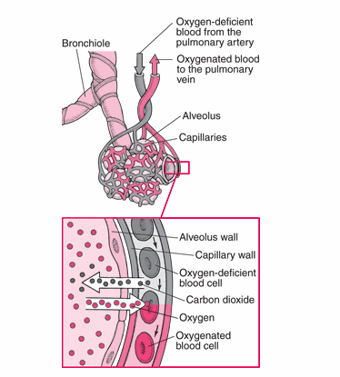

# 天气、气候和行为

### 为什么环境心理学家关心天气和气候？

环境心理学家关心的是：在不同的物理环境中，人的行为会有什么不同。

- **天气weather**：指相对迅速的变化或即时的情况
- **气候climate**：指一段时期内平均的或主要的天气状况

### 地理和气候决定论

气候影响说有三个观点：

- **决定论**：气候必然引起一类行为
- **或然论**：气候限制了人们能进行哪些活动又不能进行哪些活动
- **概然论**：认为气候并不绝对地决定特定行为，但会影响这些行为发生的可能性

### 高温和行为

对温度的知觉有生理成分（环境的热度）和心理成分（体内温度和体表温度感受器）。

人体对温度变化有适应过程。

高温对人的影响是好是坏，从以下几个方面分析：

- 唤醒理论
- 身体素质
- 环境负荷理论
- 行为约束理论
- 控制理论

### 低温与行为

低温未必会导致健康问题（事物的结果很少有单一原因）。

把人的行为归因于温度是不恰当的。

### 气压和海拔

#### 肺处理气体交换的原理

- 细胞内完成生命活动所需要的能量，都来自于呼吸作用。

- 呼吸运动受脑干呼吸中枢潜意识调控

- 呼吸运动由膈肌、肋间肌、颈部肌肉和腹部肌肉完成

- 无论有没有氧气参与，都可称作呼吸作用。有氧气参与的，称为**有氧呼吸**：没氧气参与的，称为**无氧呼吸**（无氧呼吸消耗库存，不完全产物主要是酒精或乳酸）。

- 呼吸作用的目的，是透过释放食物的能量，制造三磷酸腺苷（细胞的最主要能量供应者）。

- 氧气和有机化合物产生化学反应，转换为二氧化碳、水和能量

  

- 有氧代谢能量转换效率约为40%，比无氧代谢效率高19倍

- 空气→气管→肺部→细支气管→肺泡→氧气进入毛细血管⇋二氧化碳进入肺泡→心血管系统将血液泵入肺部

  

- 高原反应（AMS acute mountain sickness）：通常出现在海拔2438米以上，因低气压，氧气较难通过肺泡壁，身体中氧气供应不足，造成缺氧。