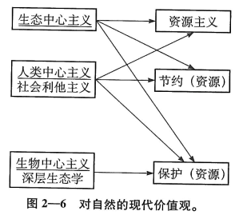
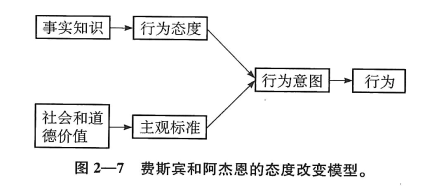
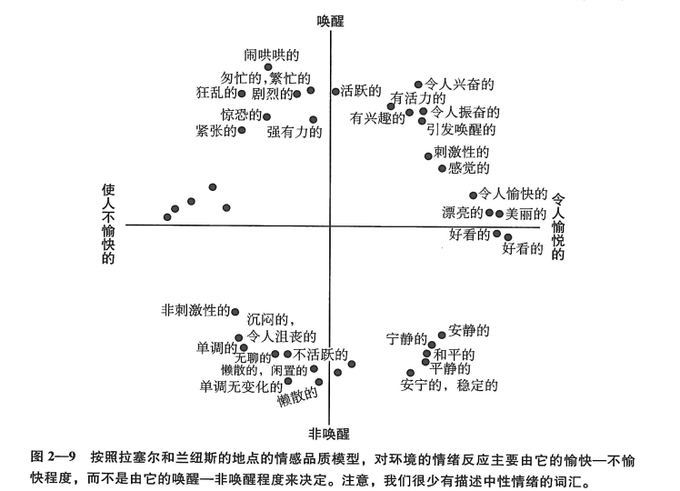
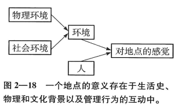

# 自然与人类本性

我们发现自己面临着心理学中最古老的一个争议。简单说，**我们的行为究竟是本能（先天决定论）还是主要依赖学习和认知过程（经验主义），在这一点上，人们的意见很不一致。**在解释我们对自然环境的感觉时，这个争议也一样存在。

## 价值与态度

态度不能被直接观察到，但可以从行为中、从自我反映和自我报告中推论出来。

通常认为伦理（ethic）和价值观（value）是比态度更宽泛的概念，表示个人、文化或宗教具有的一种标准。我们可以把价值观看做是一系列具体的、相关的态度的集合体，它们有一些抽象的原则作为总的道德性的基础。虽然这可能是一个“鸡生蛋，蛋生鸡”的问题，我们还是可以假设特定的态度是在一定的价值观基础上建立的。

### **自然含义的变化**

中世纪的欧洲把自然说成是“可怕的” “危险的” “讨厌的”，因为旅行者不愿意看那些未经开垦的山林，另一方面因为欧洲的基督徒继承了圣经中的一个偏见：伊甸园是人类被逐出的天堂，荒野是我们被流放的地方，所以荒野是世俗而亵渎的。

启蒙时期，欧洲对自然的态度有所缓和。部分原因是由于科学的帮助，人们把自然现象看做是上帝的复杂而神奇的创造。17世纪末，欧洲的知识阶层对自然不再厌恶，产生了幻想。这个感受只来源于住在城市里的特权阶级的奢华享受，而不是那些被迫居住在面对着危险而未经开垦的荒野的人们。

欧洲定居者来到北美后，发现自己首先要吃饭、要住处、要安全，这都需要先征服新的美洲荒野。

新教徒发现自己所处的环境很恶劣，冬季很难过，土壤贫瘠。恶劣环境加上新教徒保守主义的宗教传统，使新教徒把周围环境看做是充满敌意的、有威胁的、魔鬼（原住民）居住的地方。新教徒认为自己是上帝的使者，使命就是让荒野安宁并摧毁魔鬼的力量。由于不良的耕作方式，他们的土地枯竭了，下一代新教徒（一般人和知识阶层）向西运动，毁灭森林、围起大草原，意图征服巨大的美洲荒野。

中大西洋的殖民者大多是英国圣公会的信仰者，接受过更好的教育，比新英格兰的新教徒更喜欢研究和欣赏自然现象。尽管如此，他们所欣赏的景色依旧是农村的田园风光，而不是真正的荒野。

19世纪末20世纪初欧洲浪漫主义的发展促使美国人对真正荒野态度的转变。浪漫主义传统发源于城市文学的中坚人物，他们受到粗犷、广阔的荒野的吸引。在美国革命后的几十年，荒野成为了新一代美国人骄傲的来源。

21世纪美国人对荒野的态度依旧是矛盾的。

### **现代价值观：人类在自然中的角色**

从19世纪末开始，浪漫主义者对自然的欣赏与人类和自然是相互联系的生命网这种新认识得到了统一。后者源于达尔文的《物种起源》（1859）。美国人开始意识到自然资源的供给是有限的。在桑多尔·罗斯福总统的领导下，联邦政府开始对自然资源的管理，保护它们以供人类使用。这演化为**资源主义（re-sourcism）**\(Oelschlaeger,M.,1991\),它成了美国占支配性的自然知觉方式。这个观点是**人类中心主义（homo-centrism or anthropocentrism）的世界观**。人类中心价值观强调**自然对人类这个物种的有用性，自然被看做是原材料的储藏库，目的是满足人类的需要**。

**保护主义（perservationism）**强调一种整体自然观，认为生态系统大于其各个部分之和。生态系统是各个相互依赖的部分所组成的复杂系统，任何部分的变化 都可能给其他部分带来灾难性的后果。保护主义者赞同维持原本的生态系统。**这依旧是一种人类中心主义世界观的目标，是要管理自然为人类所用。**

_无价自然资产的价格评估方法_：

1. 可能价值法：问陪审团愿意付多少钱以改善环境，例如愿意花多少钱买票到一个道路经过修缮的森林远足

2. 成对比较法：让陪审团在一对项目中做选择，例如1万美元对珍上野生动物的保护，或野生动物保护对一个自行车道

#### **生态中心主义（ecocentrism）**世界观

又称生物中心主义世界观，认为自然生态因它们自己的权利而具有价值，和它们对人类的价值无关。人类没什么特殊性，人类伦理行为应该有益于地球上所有的生命。

近20年来最著名的环境价值测量是**新环境范式（New Environmental Paradigm,NEP）**的量表。基于一种新的人和自然的关系，人是自然整体的一部分，而不是脱离于自然的。

#### **深层生态学（deep ecology）**

是一个越来越流行的概念，建立在对现代技术、科学和政治结构进行批判基础上的生态主义。

自然基础的价值可分类为**自我中心中义、人类中心主义和生态中心主义**。

## 环境态度

### 价值观决定态度，态度塑造行为。

尽管有证据表明有一部分的态度是由遗传引起的，也有的是直接由感觉输入引起的，但多数理论相信态度主要是习得的。因此，态度的形成可能涉及许多经典条件作用、操作性条件作用原理、社会学习原理。

### 环境评估

#### 品质评估

环境评估广义上包含描述环境和其组成的各种努力。

* **环境品质指数（Environmental Quality Index,EQI）**

  **定义**：应用现代技术评估污染、噪声、资源恶化和环境的其他可直接测量的方面

  尽管这些指数本身可假定为客观的物理测量，但品质这个概念包含着主观评估的含义。主观评估的不同反映了受个人习得和背景影响的态度、信念、感觉之间的对立。

  **环境知觉品质指数（Perceived Environmental Quality Index,PEQI）**:评估人群受环境因素影响的大众的平均反应测量。例如，评估空气、水、噪声污染、居住质量、景观、景观资源、室外休闲便利程度、交通系统、企业和工作环境等。

  **环境情绪反应指数（Environmental Emotional Reactiong Index,EERI）**:评估人群对环境的主观情绪感受

* **情感唤醒**

  

  **用同样的心理学维度评估同样的环境，人们的选择却不相同。原因是适应水平（adaptation level）的不同。**

* **环境景观：景观美学与偏好**

  景观评估和管理的原则有以下几种：

  * **描述性方法：景观的经验性判断和艺术判断**

    这个方法强调从实践和艺术的判断中引出一些设计原则。

    描述性方法强调对比的重要性。人类的视觉系统就是特化为检测对比的，特别是能检测那些简单的线条和形状，并能搜索焦点或者其他组织结构。

    总的来说，专家猜测自然的要素比人类活动的产物更受偏爱。

    描述方法依赖于艺术传统（而不是实验和资料），所以被认为缺乏信度和效度。因此，现在更多**使用在使用者反馈基础上建立带有偏好的模型来补充专家意见的做法**越来越受到关注。

  * **景观评估的物理知觉方法**

    这个方法强调环境物质特性，这个特性和景观品质或判断偏好有统计学上的联系。

    大多数证据发现，景色品质和这些特征有关：

    * 相邻地段使用上的兼容性
    * 绝对或相对的不单调性（比如有高有低，有山峰有山谷，有峡谷有盆地）
    * 险峻性
    * 天然性
    * 森林管理的实施

    物理知觉法运用实验，比艺术的方法或专业的实践更适合行为科学的传统。总的来说，研究显示了**在同一文化中及跨文化比较时对品质和价值判断的一致性**。

  * **环境评估的心理变量**

    在景观中，对其复杂性或类似的心理预测因素进行物理测量是困难的，因此对这些因素的测量通常靠主观判断。典型方法是，**找一组人判定某景观的复杂性、独特性、模糊性、宽敞性等，再让这些人或另一组人评定这景观的品质和美丽度。**

    影响人类判断的一些心理特征：

    * 生物学影响：生物偏爱或生物恐惧

      生物偏爱：人类的行为不是以某些对环境的理性评估为基础的，我们喜欢的是那些使我们的功能能更好发挥的环境。（Edward O. Wilson,1984）。人类的行为符合功能进化原理，许多行为功能是为了增加我们的生存机会，是由我们在进化中获得的遗传行为倾向所引导的。

      生物恐惧：可理解为一种预先学习过程，它使人更容易学会避开那些在进化中威胁着人类的事物和环境。

    * 形式化的美（伯伦的美学）

      在环境美学中扮演重要角色的有：

      1. 复杂性
      2. 新奇性
      3. 不一致性
      4. 惊奇性

      伯伦把人类的探索分为两种：

      1. 多样性探索：一个人缺少刺激时，在环境中寻找刺激
      2. 具体性探索：一个人被某种刺激唤醒后，寻找信息以减少不确定性，或满足唤醒带来的好奇心

      当不确定性和矛盾增加时，和具体性探索有关的唤醒增加

      不确定性增加时，享乐度（愉快程度）先增加，后减少

      **当刺激和不确定性程度适中时，不关注过度的刺激和过度的唤醒时，我们的快乐度最高。**复杂性、新奇性和惊奇性适中的环境将被评价为最美丽，而对这些特性过高或过低的环境的评价将不那么美丽甚至是丑陋的。

    * 卡普兰和卡普兰偏好模型

      我们会喜欢或偏好的景观，是那些适合我们这个物种的特点并在其中最用得上的环境。人们一般会被那种他们的功能能最有效地在其中实现的环境所吸引。我们会被人们能（或过去能、历史上能）生存的环境所吸引。

      人类喜欢包含有快速的、能理解的信息的环境。

      卡普兰把信息维度组织成一个由4个部分组成的偏好矩阵：

      1. 一致性（Coherence）,越一致，人们对这个景色越喜欢
      2. 易识记性（Legibility）,越易于辨认和理解，内容越易于分类，人们越喜欢
      3. 复杂性（Complexity），景色中各种要素的数量，复杂性越高，人们越喜欢
      4. 神秘性（Mystery），景色中有隐藏的信息，吸引着人们进入并找出这些信息，越神秘，人们越喜欢。**（观察者的心理特点，包括成熟度，和环境共同决定了对环境的知觉，神秘感的存在提高了出现的情感基调）**

      卡普兰强调熟悉性在评估景色的价值中的作用。一般来说，那些熟悉的，特别是“古老的和真实的”东西，使景色更让人向往。

## 自然的恢复效果

不论我们和自然因素亲近的原因是什么，有证据表明参观一个自然之地，甚至仅仅是看自然景色的照片，都有一种复原的效果。

* **压力减少**

  人与特定的自然环境类型接触会产生所谓的“恢复反应”，那些使人能形成这种反应的地方被称为“恢复性环境（restorative environments）”。

* **注意恢复理论**

  任何计划，只要是强度足够大而且持续时间足够长（即使是令人愉快的任务）,就会引起定向注意疲劳（directed attention fatigue）。按照注意恢复理论（ART），要让注意指向休息，要找到另一种不同的、无意的，只需要付出很少努力的注意，入迷就是一种无意注意。
  
  自然环境被看作是一个重要资源，是一个能引起人们注意的迷人事物。
  
* **恢复性的自然：再思考**

  注意恢复理论（ART）和压力减少理论被认为是相互对立的理论，但未来这两个解释很可能会最终融合在一起。比较确定的是，很多人相信自然有一种恢复性效果。
  
## 作为地点的自然景观

地点依恋这个概念表示**人们对特定地点有一种根的感觉**。

地点中心的态度是个人化的、有很高价值的、甚至会被知觉为精神性的或宗教性的。

对地点的经验似乎是私人性的，人各有异。关于地点的许多研究也都是现象学（phenomenological），也就是说，是**基于人们对经验的主观描述**。

我们对自然环境知道些什么？**它们被情感所渗透，一方面因为它们美的特征，另一方面也因为它们和我们记忆中的事、人、感受相联系**。

**一个地方的意义是个人生活史和环境的累积相互作用的结果。对地点的经验往往包含着一种拥有感。它是一种人和这个特定地点之间有不同寻常的、特别的关系的感觉。**心理拥有感的品质有许多称谓，可以叫“领域”，“血族关系”，“内部人”和“外人”的区分。

**地点既是人类兴趣的对象，也是情绪、感受和其他反应产生的原因。**地点最好被理解为物质环境和人在其中的行动的交互作用。