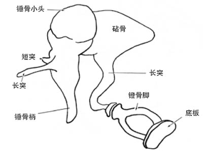
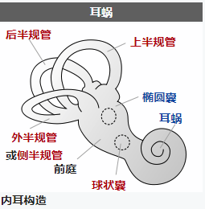
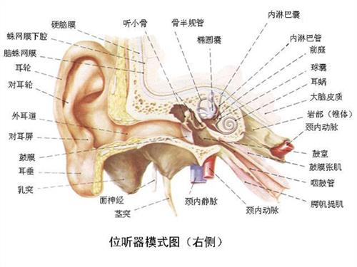
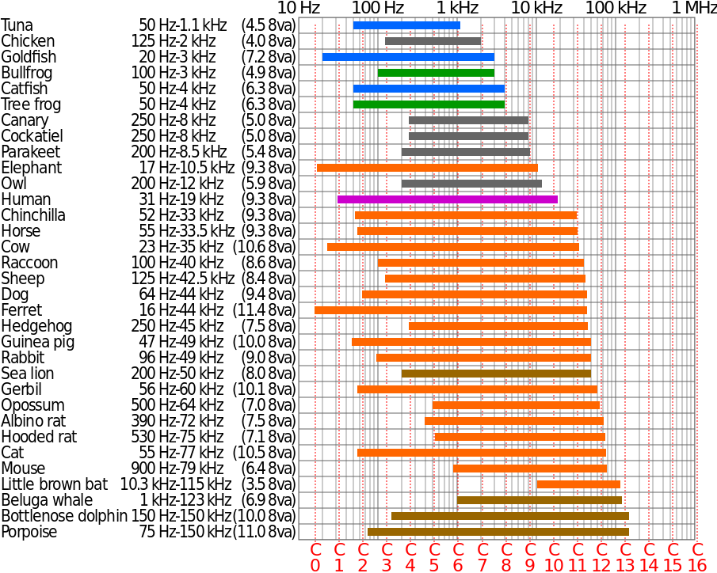

# 声音传播原理相关

## 听觉

声波是由于四周的空气压力有节奏的变化而产生，当物件在震动时，四周的空气也会被影响。当物件越近，空气的粒子会被压缩；当物件越远，空气的粒子会被拉开。

当声波的频率和强度达到一特定值范围内，才能引起动物的听觉。人耳能感受到的振动频率范围约为20-20000赫兹。随着年龄的增长，听觉上限会降低，强度范围为0.0002-1000 dyn/cm²。

## 生物听觉系统构成

听觉器官通称为耳，其结构中有特殊分化的细胞，**能感受声波的机械振动并把声能转换为神经冲动，叫做声感受器。**

高等动物的耳可分为外耳、中耳和内耳。

- **外耳**：包括耳廓和外耳道，主要起**集声**作用；有些动物的耳廓能自由转动。

- **中耳**：中耳包括鼓膜、听骨链、鼓室、中耳肌、咽鼓管等结构，主要起**传声**作用。

    - **鼓膜**：封闭外耳道内端的一层薄膜结构。声波从外耳道进入，作用于鼓膜，后者随之产生相应的振动。
    
    - **听骨链**：哺乳动物的听骨链是由3块小骨（锤骨、砧骨、镫骨）组成的杠杆系统，一端为锤骨柄，附着于鼓膜内面，另一端为镫骨底板，封盖在内耳的卵圆窗膜上，鼓膜的振动通过这一杠杆系统可以把声波放大20倍，有效地传至内耳。
    
    
    
    - **鼓室**：鼓室介於外耳與內耳之間，是顳骨岩部內的一個不規則的小氣腔，其外側壁為鼓膜，內側壁即內耳的外壁。
    
    - **中耳肌**：中耳肌又名耳内肌，有两块：鼓膜张肌的收缩通过牵拉锤骨而使鼓膜紧张，镫骨肌的收缩使镫骨固定，其作用都是**限制声音向内耳的传导**。
    
    - **咽鼓管**：咽鼓管（耳咽管）由鼓室通至咽部，平时关闭，吞咽和某些口部动作时开放，可使鼓室内的空气压力经常与大气压力保持平衡。
    
- **内耳**：包括前庭系统和耳蜗，负责**平衡**和**声音的解析**。

    
    
    - **前庭系统**：作用于人**自身的平衡感和空间感，对于人的运动和平衡能力起关键性的作用**。它和听觉系统的一部分耳蜗一起构成了内耳迷路，位于内耳的前庭。由于人的运动由旋转和平移两种方式组成，前庭系统也由两个部分组成：半规管系统，感知旋转动作；以及耳石，感知直线加速。前庭系统发送神经信号给控制眼球运动的神经系统，保证我们在移动时也能拥有清晰的视觉；也发送信号给肌肉相关的神经结构，使我们保持直立。
    
    - **耳蜗**：骨质外壳包着的管状结构，由三个内部充满淋巴液的空腔组成，卷曲数圈（人类为两圈半）呈蜗牛状，负责将来自中耳的声音信号转换为相应的神经电信号，交送脑的中枢听觉系统接受进一步处理，最终实现听觉知觉。
    
        - 前庭阶/前庭管（Scala vestibuli），内含外淋巴（Perilymph）液体
        - 蜗管/中管（Scala media），内含内淋巴（Endolymph）液体
        - 鼓阶/鼓管（Scala tympani），内含外淋巴（Perilymph）液体
        
        **毛细胞（Hair cells）**：规则地分布于基底膜之上，自耳蜗底端至顶端的全长范围内形成平行的四列。内毛细胞是感受器细胞，与若干个听神经纤维形成突触连接。负责将机械振动转化为与之相连的听神经纤维的动作电位。外毛细胞与来自上橄榄核的传出神经以及另一类型的传入神经（称为II型传入纤维）形成突触，其生理功能尚不完全清楚，一般认为与增强听神经的高度频率选择性、耳蜗的调节和自我保护机制有关。**毛细胞死后亦无法再生，所以人一生的听觉能力不断减退。**
        
        **耳蜗和人体的平衡能力并无关联。**

## 耳的声学特性

### 耳的声阻抗 

声音在介质中传播时遇到的阻力叫声阻抗。介质为空气时阻抗大，为固体或液体时阻抗小。**耳的声阻抗主要指在声传导时中耳结构所具有的总阻抗**，它对听觉器官的灵敏度、频响特性等有决定性的影响。中耳结构任何部分的病变一方面影响听觉功能，另一方面会使耳的声阻抗呈特征性的变化。

### 中耳的传声途径

陆生动物鼓膜接受的是气播声，内耳感受细胞接受的是液播声，由于声波在空气介质与淋巴液介质传播时阻抗的不匹配，从空气至淋巴液的直接过渡将使声能大量损失，传播效率约只千分之一，正常耳的传声途径是声波作用于鼓膜，经听骨链传导至内耳，叫气传导。鼓膜的有效面积比卵圆窗膜的约大20倍；听骨链的杠杆结构使鼓膜端振幅大、力量小的振动，变成镫骨底板端振幅小、力量大的振动，有如一个变压器，起到阻抗匹配的作用，从而保证了有较高的传声效率。

声波也可以**通过头骨的振动直接传至内耳，叫骨传导**，这一传声途径效率很低，对正常耳的听觉作用不大，但在中耳有严重疾患时，听觉便主要靠它。

**声波在耳蜗中的传播**：通过振动推动前庭阶内的淋巴液浪起来。

## 听觉的基本特性

听觉系统的基本功能是感受声音和辨别声音。感受声音的能力叫做听力，通常以听阈的高低表示，**听阈低表示听觉灵敏或听力好**，辨别声音的能力可用各种辨别阈表示。

- **听阔**：足以引起听觉神经冲动的最小声音强度，通常用分贝数表示。人的听阈可用主观感觉作测定指标，动物的听阈则需用条件反射、行为观察或电生理方法测定。正常耳听阈的高低因频率而异，不同的动物种类也不相同，各种哺乳类动物听觉灵敏的频率范围虽不相同，但它们的最佳听阈颇为接近，阈值声压大致在0.00002帕（斯卡），这样的声压使鼓膜振动时位移的幅度约为0.1纳米。这是很高的灵敏度，但若再提高就不见有生物如此了，因为可能因要经常不断地听到空气分子布朗运动的声音而日夜不得安宁。

- **听频范围**：在强度足够大时（以不引起听觉以外的其他感觉为限）可听到的频率范围在人类约20～20000赫，因此，习惯上把这一范围叫做声频，20000赫以上的频率叫超声，20赫以下叫次声。动物的听频范围较难准确测定，总的说来种类间差别很大。

