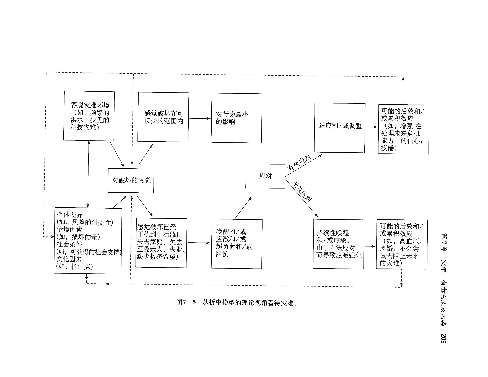

# 灾难、有毒物质及污染

## 自然灾害

### 特征

- **自然灾害往往不可预测（不可控）：**
  - 不可预测发生时间
  - 不可预测准确的发生地点
  - 通常是突发的
- 持续时间较短
- 具有最低点

## 对自然灾害的知觉

- 危机效应：灾难发生期间和刚发生之后，人们对它的意识和关注最强，但经常忘记努力去预防下一场灾难
- 堤防效应：一旦采取一些预防灾难的措施，就会认为未来无忧，但计划往往是不准确的
- 适应：人类会适应灾难的威胁，以致听到灾难事件不再害怕
- 人格变量：影响人们在知觉到灾难后所采取的行动

## 自然灾害对心理的影响

- **急性应激反应**
  - 压力、焦虑、沮丧、抑郁和其他类似不安情绪
- **长期影响**
  - 创伤后应激障碍（post-traumatic stress disorder,PTSD）

## 环境理论和灾难

生活社区被破坏→行为受限→被迫离开家，搬到避难所→被迫遵守规范行动→因失去自由而反应消极→努力重新获得自由→努力失败后，习得性无助→灾难过后，限制慢慢消失→心理状态恢复

## 科技灾难

### 科技灾难的特点

- 是人为的（过失或失算造成的）
- 比自然灾害更可能威胁到人们的控制感，更容易导致压力产生
- 破坏性不如自然灾害的明显
- 在潜在的普遍性
- 根本不可预测
- 灾难过后更容易引起人与人之间的冲突（互相推卸责任）

### 科技灾难的影响

- **急性应激反应**
  - 压力、焦虑、沮丧、抑郁和其他类似不安情绪
- **长期影响**
  - 比自然灾害的后果更复杂，持续更久
  - 更多的精神痛苦，包括情绪障碍
    - 焦虑
    - 退缩或麻木
    - 抑郁
    - 与应激有关的生理症状，如身体疼痛，功能紊乱
    - 没有目标的愤怒
    - 行为倒退
    - 噩梦

### 直接受害人和间接受害人

直接受害人：直接受到灾难影响的人

间接受害人：没有直接受到灾难影响，但也遭受损失的人

## 建筑物综合征

指人们在某栋特别的建筑物或某个特别工作中，出现一些不适但没有明显症状的疾病。

