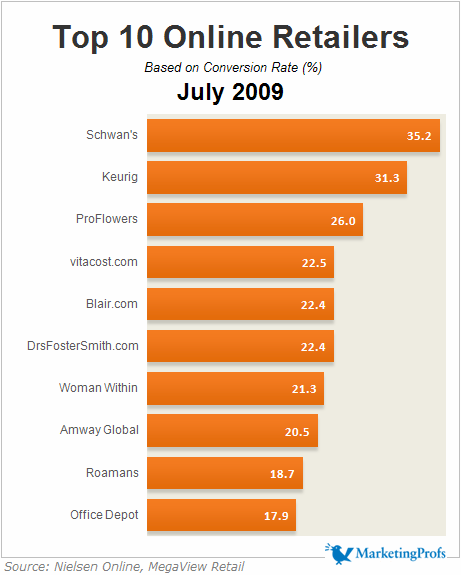
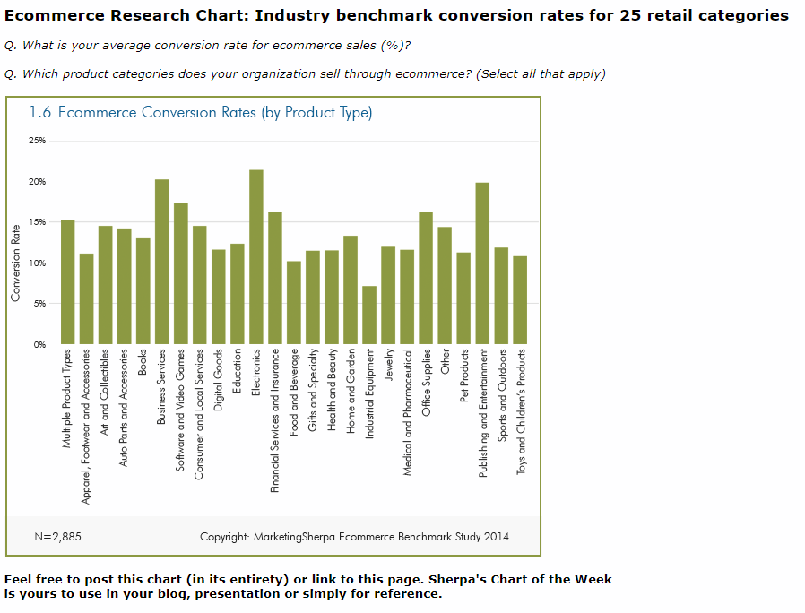

# 电子商务：底线在哪里

## 确定参考标准

- **桌面电脑**：创造
- **平板电脑**：消费
- **手机**：互动

### 转化率

如果你是一个在线零售商，一开始的转化率会在2%左右，如果能到10%，已经做到非常好了。

### 购物车放弃率

65%的人会在付款前放弃购物。

### 搜索效果

79%的在线购物者会到50%的时间花在调查商品上，44%的购物车会从搜索开始购物。

不要只想着“移动优先”，要意识到“搜索优先”，要在监测网站和产品的搜索指标上进行投资，看看用户在找什么，以及他们找不到哪些东西。

