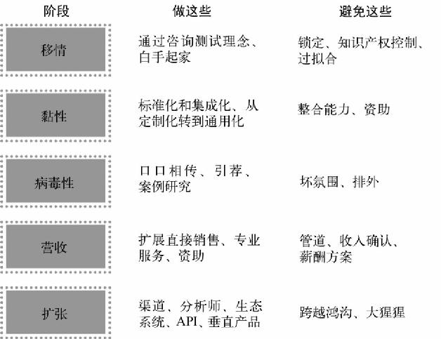

进入企业市场

多数B2B创业公司由两个人组成：一个领域专家和一个破坏式创新专家。

- 领域专家了解产业以及问题领域。他拥有一个名片盒，可以在产品定义的早期阶段充当客户的代理人。这个人通常是业内人士，并具有营销、销售或业务拓展的角色。
- 破坏式创新专家了解能产生变革从而让公司获利的技术。他能透过现有的模式预见到变革之后产业的发展，能向现有的市场引入新方法。这个人通常是技术专家。

## 企业市场创业公司的生命周期

### 向企业转型

### 复制并重建

### 破坏现有问题

要记住，**业内人士也需要“走出大楼”并验证他们的假设**；<u>如果因为有了领域专家就不这样做，结果会是灾难性的。</u>

### 移情：咨询和细分

