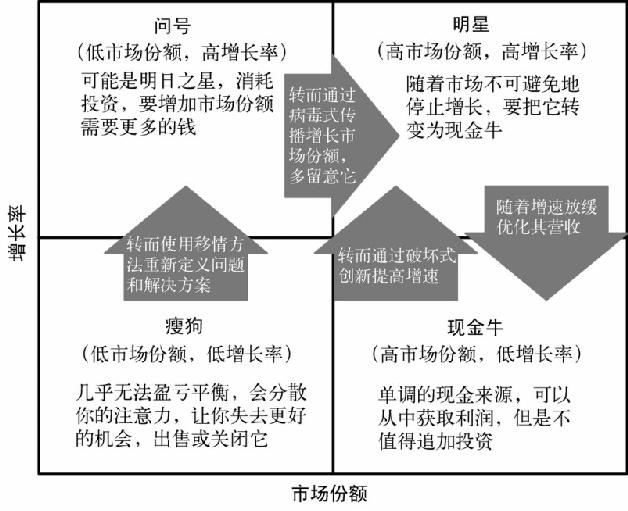
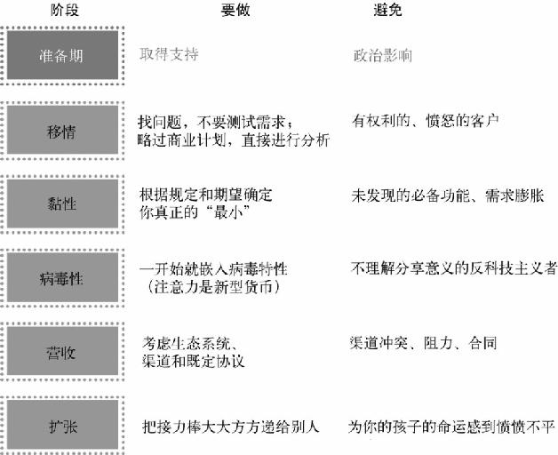

# 企业内部的精益之道：内部创业者

快速改变现状非常困难，如果你打算这么做的话，你需要有与所担负的责任匹配的权力。要是你试图从内部发起破坏式创新，那你还有很长的路要走。从创业公司中拿来的很多经验都适用于大公司，但是你得略施调整才能在大公司中推行。

- 你要做的事情可能会**危害到现存的业务** ，或威胁到一些雇员的工作。人们对此会失去理智。
- **惰性是真实存在的** 。如果你要求人们改变他们的工作方式，至少要告诉他们为什么。
- 如果做得好，你还会**破坏生态系统** 。
- 你的创新会**由别人来决定生死** 。尽管你很容易只看到自己的工作，并鄙视公司里其他人所做的事情，你们毕竟都还在一条船上荣辱与共。“但是一旦你转而使用公司用语思考，你就能比较容易地放下你的成见并从公司的角度看问题。”

内部创业者要想事业有成需要具备相反的素质，这些素质大多受数据和迭代的影响。你需要获取真实的信息，你要跟着数据指引的方向走，要避免确认偏误。将你自己的假设和先入为主的观念扔到一边去吧，做最好的努力，做最坏的打算。

## 内部创业者的臭鼬工厂模式

臭鼬工厂的快速行动需要授权和成果。它设立了14条指导原则9 （也被称为**Kelly的14条实战法则** ，得名于工程师团队负责人克拉伦斯·约翰逊的代号“Kelly”），这些原则可以适用于任何想从内部改变一个公司的人。

1. 如果准备打破常规，你需要做出改变的职责以及权力，而这种权力只能从公司高层获得。找一位执行发起人支持你，而且要让每个人知道你有个靠山。
2. 要坚持获得所在公司的资源和接触真实客户的机会。你可能要获得支持团队和销售团队的准许才行。他们不会喜欢你的做法，因为接触客户会带来改变和不确定性，但是无论如何要坚持这么做。
3. 要建立一支由不畏风险、执行力强的高手组成的精干、敏捷的团队。如果你无法组起这样一个团队来，说明你并没有**真正**获得高层的支持。
4. 要使用适应于快速改变的工具。要用租用来代替购买。尽量使用按需购买的技术，如云计算。尽量产生运营成本而非资本性支出。
5. 不要陷入无休止的会议，要简短连贯地做报告，但是要自觉记录进展以供日后分析。
6. 保持数据的更新，不要试图向组织隐瞒实情。要考虑你在推动的改革的总成本，不要仅考虑短期成本。
7. 如果有更好的供应商，不用畏首畏尾，你可以选择他们。必要的时候，你也可以利用所在组织的规模和已有合同产生的优势。
8. 简化测试流程，确保你新产品的组件本身是可靠的。不要重复制造轮子。尤其在早期，尽量用现有的模块搭建产品。
9. 吃自己的狗食（即亲自使用自己做的产品），面见终端用户，不要把测试和市场调研推给别人。
10. 在项目启动前，要对目标和成功标准达成一致意见。对于争取高层支持，这一点至关重要。同时，它也可以消除大家的困惑，避免发生需求膨胀和目标漂移。
11. 确保你不需要繁琐的审批就能获得资助和运营资金，也要有在项目进行中开除某个人的权力。
12. 经常与客户沟通，至少在支持部门或售后部门找个代理人来与客户沟通，以避免发生误解和混淆。
13. 尽量不要让外部人接触你的团队。不要让唱反调的人影响你的团队。在充分测试好之前，不要向公司透露不成熟的想法。
14. 打破正常的薪酬文案，论功行赏。毕竟你想让这些创业者留在公司里，而他们本来是可以自己出去做一番事业的。

## 改变，是以创新来对抗改变

<u>一个公司要改变，要么是被威胁所迫，要么是受高层自上而下的推动。如果同时具备两个条件，即使是大公司也会迅速行动。</u>

波士顿矩阵能够概括一个公司的产品序列。在考虑创新时它也很有用。当你想改变一个公司时，或者是试图创造一个全新的产品（最好还处于一个增长的市场中），或者是试图通过在新功能、市场或服务方面的创新来重振已有的产品。

**现有的组织在运营中有一些固定的参考框架，你需要能够跳出这样的框架，不拘泥于现有的解决方案，而是观察实际的需求，这是任何内部创业者应该具有的基本能力。**

> 克制做调研和量化研究的冲动；一对一的观察中所得到的灵感可以让你重新发现一整块市场。

### 与执行发起人一起工作

<u>作为内部创业者，你和你的执行发起人需要十分清楚这些事情：你们要带来什么样的改变，如何衡量你们取得的进展，你们会获得什么样的资源，以及你们会遵守哪些规则。</u>对于图谋打破现状的人来说，这可能看起来过分“公司化”了；但是在一个大型组织中，现实情况就是这样。

如果你不喜欢这些事情，去成立自己的公司吧！如果想在体系内部工作，你追求的改变必须是组织能够接受的改变。这就是为什么有高层的支持如此重要：这一点是“流氓特工”和“情报特工”之间的差别。

**拥有大量的数据并不能说明你是数据驱动的。有时，从分析一个服务于特定目的的小数据集开始着手，可以让你得到充分的理由来说服组织把数据应用到其他业务。**由于这样的问题有约束和限定，所以更容易获得高层的支持；相反，在组织过去积累的大量“数据废料”中，谁知道还隐藏着哪些争议问题呢?

## 内部创业者的精益分析阶段

### 准备期：取得高层支持

在这个阶段，你在定义你的分析策略，以及你需要比照的底线。这些指标可以是整个公司的目标（如利润），也可以是代表成功的某个增长速度。你也需要明确这一点：你会如何根据你学到的事实调节这些指标。

### 移情：去找问题，别测试需求

一旦你开始进行客户开发，要记住你在测试问题和解决方案，而不是现存的需求。如果你的创新真的是破坏性的，客户不会告诉你他们想要什么，他们会告诉你为什么他们想要它。

**略过商业计划，直接进行分析**：你推销的不是商业计划，而是商业模式，你不进行预测，而是进行分析，你要依靠分析来决定是放弃产品还是加倍投入。你不需要一大笔启动资金，而是可以提出一个不太大的预算，在产品中嵌入分析功能，用尽量少的钱尽快着手开发产品。当你获得了数据和客户反馈后（在今天的技术条件下成本几乎可以忽略），就可以使用实际的证据来支持你的商业计划。

### 黏性：想清楚“最小”对你来说是多小

你需要知道，对你来说，你能开发的“最小”是什么样的。作为大企业，你需要遵守关于数据共享、可靠性或兼容性上的许多规则（小公司则不必，因为它们损失不了多少）。你也要意识到你相对小企业的不公平的优势在哪里。

*当人们开始使用你的最小可行化产品时，你得小心处理测试过程。你可能会干扰销售流水线上现有的交易，还可能增加客户服务的工作量。*<u>如果有这种情况，你就需要先获得批准再推出产品，而且要取得所有利益相关者的支持。</u>如果你准备推出一条全新的产品线，你甚至可能要掩饰这种企图，使得在你确信成功之前不会侵蚀已有市场。这样做当然也有缺点，你可能无法运用某些不公平的优势，比如现有的客户基数。

### 天生要有病毒性

如果你打算在波士顿矩阵中占据更高的位置，你的产品就应该天生包含病毒式传播和口耳相传的元素。

### 在生态系统内取得营收

你在给产品定价和将收入再次投入产品营销时的自由度都会受到限制，因为随着你的增长，你终将要与所在公司的其他销售业务和平共处。

在定价时你可能需要考虑渠道、分销商以及其他限制你自由实验的因素，因为你带来的改变会给市场上的其他产品造成影响。

### 扩张和移交

多数情况下，一个产出破坏性创新组织的DNA难以适应“枯燥”的管理和增长，所以你还是将产品移交给公司内的其他人，自己寻找下一个创新突破口为好。这说明实际上你有两种客户：公司外面买你产品的人，以及公司里面需要制造、销售和支持产品的人。

归根到底，内部创业者不仅要处理与目标市场的关系，也要处理与所在组织的关系。最初你可能有意希望这很遥远，但是随着破坏性的产品融入所在公司的产品线，你还是应该优雅地把它移交过去。