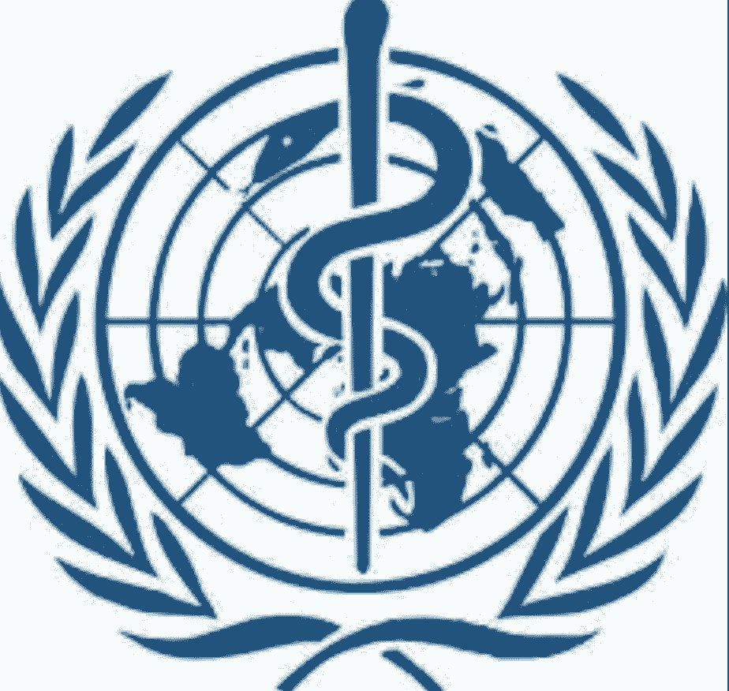

# 汞：无孔不入的疗愈神器

16世纪~20世纪上半叶，甘汞（氯化亚汞）作为治愈神药存在。

**汞**被称作“水状的银子”，是唯一一种俗名与炼金术与罗马神祇有关的金属，与罗马神话中墨丘利及水星的写法Mercury相同。

**墨丘利的象征**：双蛇杖，被普遍但错误地与医学机构联系在一起，是因为1902年**美国空军医疗队**误用了这个标志，很快变成一种象征疗愈的标志，实际上，双蛇杖代表的是墨丘利————经济、商业、小偷、骗子之神。

健康和疗愈的守护神阿斯克勒庇俄斯的权杖，只有一条蛇缠绕在一根简单的棍子上。

{width=300 align=left}

{width=300 align=right}
