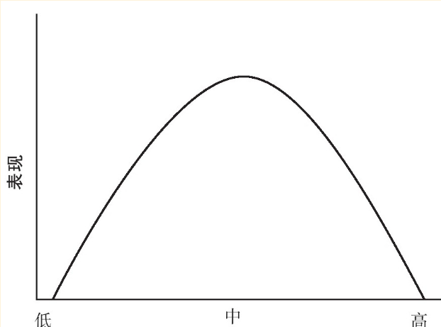

# 稀缺陷阱

稀缺陷阱源于人们**将可预期事件当作突如其来的事件处理。**避免落入稀缺陷阱的**唯一**方法就是要**拥有余闲**，尤其是要建立起应对突发事件的缓冲机制。改变心态，才是人们逃离稀缺陷阱的唯一希望。

**稀缺陷阱的根源在于对资源的错误利用，从而出现了实际的短缺。**

如果长时间地经历“最后关头”，就会一直处在所谓的“杂耍”状态，也就是持续从一项紧要任务转移到另一项紧要任务的状态中。**“杂耍”是管窥的必然结果。**

杂耍，并不是因为时间不够用而心烦意乱，而是因为人们的大脑中装了太多需要做的事情————大部分带宽都用来为抛向空中尚未坠落的球而焦虑。

**生活在稀缺陷阱中，你所拥有的就会比实际应拥有的更少。**

逃离稀缺陷阱，首先就需要制订计划。制订计划很重要，但并不紧急，而这类事情正是管窥心态导致我们所忽略的事情。

**逃离稀缺陷阱需要的不是偶尔表现出来的警醒，而持续、永恒的警醒————一种在任何时间里都能抵御所有诱惑的能力。**

在我们不断进行自我控制时，自我控制力很可能会被消耗掉。

任何一点小小的不稳定都会威胁到生存于稀缺陷阱边缘的人，因为他们没有足够的余闲去吸收这些不稳定因素，只能任由其影响自己的生活。

为了远离稀缺陷阱，仅拥有比寻常欲望更多的资源是不够的。我们要拥有足够的余闲（或其他一些机制），以去应对任何时候都有可能突然出现的重大事件。**我们要建立起针对突发事件的缓冲机制，在关键时刻就会有所需要的余闲，还可以用来保护我们免于再次跌落到稀缺陷阱之中。**

#### 社交中的稀缺感

**表现和关注度的关联性呈现为倒转U型弧线：关注度过低，表现会变弱；关注度过高，表现同样会被消弱。**

