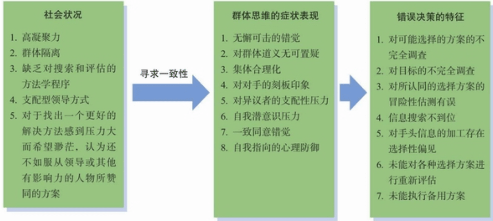

# 群体影响

### 社会助长作用：他人在场的影响

**纯粹他人在场**

唤醒：指个体在生理和心理上的觉醒状态，准备对外界刺激作出反应。**社会唤醒**能促进优势反应，提高简单任务的作业成绩，降低困难任务的作业成绩。

> 要有所发现不仅要见人之所见，更要思人之未思。————奥尔贝特·圣捷尔洁

**拥挤现象：众多他人在场**

“处在人群之中”对个体的积极或消极反应都会有增强作用。当人们在一起坐得很近时，友善的人会更受人欢迎，不友善的人会更令人讨厌。

**他人在场引起唤醒的原因**：

    - **评价顾忌**
    
        如果人们认为在场的观察者正在评价自己，那么他们的优势反应就会明显增加。
    
        他人评价引发的自我意识也会干扰我们熟练掌握的自动化行为。
    
    - **分心**
    
        参与者在考虑共事者在做什么或者观众会怎么反应时，已经分心了。注意他人（包括其他分心物）和注意任务之间的矛盾冲突使认知系统负荷过重，引起了唤醒。
    
    - **纯粹在场**
    
        他人纯粹在场也会引发一定程度的唤醒。

### 社会懈怠：群体中的个体减少努力

社会助长作用经常发生在人们为个人目标努力时，他人可以对个人作出的努力做出单独的评价。

一旦成为注意的焦点，人们就会自觉监控自己的行为。一旦受他人观察，个体的评价顾忌会有所增强，一旦消失在人群中，个体的评价顾忌就会减小，社会懈怠就发生了。

群体目标极具吸引力，又十分需要每个人都尽最大努力，这时团队精神会维持并增强个人努力的程度。面临挑战性任务时，人们可能会认为付出自己的努力是必不可少的。假设人们认为小组中其他成员靠不住或者没有能力做出多少贡献，他们也会付出更大的努力。**只要群体成员坚信付出更多的努力就能够取得好的成绩并且会带来回报，他们就会努力工作。**

保持较小规模的工作群体并使构成群体的成员实力均衡，也有助于使成员相信自己对群体的贡献必不可少。

### 去个体化：群体中的个体失去自我感

**引发去个体化的环境**：

    - 群体规模：引发成员的唤醒状态，也能使成员的身份模糊化。群体的规模越大，成员越有可能推动较多的自我意识，因为每个个体的评价顾忌都降到了最低水平，所有人会把其行为的责任归因于情境而不是自己的选择。
    
    - 身体匿名性：匿名性使人们的自我意识减弱，群体意识增强，更容易对情境线索作出回应，无论线索是消极的还是积极的。
    
    - 唤醒和分心活动：群体表现出攻击性之前常常会发生一些较小的引发人们唤醒状态或分散其注意力的事件。
    
    - 弱化自我意识：能弱化自我意识的群体体验通常能分离个体的行为和态度。**无自我意识、去个体化的人更难自控，更难自律，更可能毫不顾及自己的价值观就做出行动，对情境的反应性也更强烈。**
    
    自我觉察是去个体化的对立面。自我觉察的人，会表现得更加自控，这时他们的行为也能够清晰地反映他们的态度。
    
    自我觉察的人也不太可能做出欺骗行为。自我意识的个体，或仅是受他人驱使而产生暂时性自我意识的个体，在情境中会表现出更大程度的言行一致性。这些个体也会越来越理智，因此，也不太可能受有悖于自己价值观的情境所影响。

### 群体极化：群体对个体观点的强化

**群体讨论通常可以强化其成员最初的意向。**

**形成观点极化的原因**：

    - **信息影响**
        
        由于接受了事实的证据而产生的影响。
        
        讨论中积极参与会比消极聆听更容易导致态度的转变。一旦参与者用自己的话语表达该观点时，言语的使用会扩大这种影响作用。群体成员对别人观点重复得越多，他们就越可能 不断的复述中认同这些观点。
        
        **在中心路径的说服中，人们怎样看待某条信息很关键。**
        
    - **规范影响**
    
        基于人们希望被他人接受或敬仰的愿望而产生的影响。
        
        我们人类希望能对自己的观点和能力做出评价，为此我们可以将自己的观点与他人比较。我们常常被“参照群体”中的人们所说服。所谓参照群体就是与我们相一致的群体。而且，当我们发现其他从和自己持有相同观点时，为了使其他从喜欢我们，我们会将观点表达得更为强烈。
        
        个体的观点得到社会化巩固后会产生极化效应。

### 群体思维：群体对决策的影响

**群体思维**：在群体决策中人们为了维护群体和睦而压制异议。

**群体思维的症状表现**：

- 无懈可击的错觉：对自我的过分自信
- 对群体道义无可置疑：群体成员接受了其所在群体内在的道义，忽略了伦理和道义上的其他问题
- 合理化：群体以集体投票将决策合理化的方式来减少挑战
- 对对手的刻板印象：陷于群体思维的人们往往会认为自己的对手 是太难于协商就是太弱小愚蠢以至于难以抵抗他们的计划
- 从众压力：群体成员会抵制那些群体的设想和计划提出疑问的人
- 自我审查：由于异议往往会令人不舒服，而且整个群体似乎表现出一致性，所以人们往往会将自己的疑虑压制下来。
- 一致同意错觉：不要去破坏一致性的自我潜意识压力会导致一致同意错觉。而且，这种表面上的一致性更坚定了群体的决策。
- 心理防御：群体成员会阻止对相反信息以及问题的各种可能性的探寻以及讨论。

        
**头脑风景法只在被高度激励和多样化的群体中才十分有效，并且这些群体要事先准备好可能 的观点。**

### 少数派影响：个体对群体的影响

少数派影响的决定因素：

- **一致性**

    那些坚持自己立场的少数派更具影响力。
    
- **自信**
- **从多数派中叛离** 
        
    任何立场的社会影响力取决于它的力量、即时性以及支持者的数量。
    
    少数派更可能使人们发生转变而接受他们 的观点。
    

怎样能产生好的领导往往取决于情境。

**任务型领导**通常是支配型的————如果领导能够睿智地发出指令就能很好地完成工作。由于是目标取向的，这样的领导会将群体的注意力和努力都放在任务上。特定的、有挑战性的目标再加上周期性的进程报告会促进高成就的实现。

**社会型领导**通常具有民主风格————他们代表了权威，接纳团队成员的意见，并避免出现群体思维。这样的领导有利于鼓舞士气。群体成员在参与决策时通常表现出更高的满意度。如果对员工们的任务加以控制，他们也会更受鼓舞去获取成就。

如果能有机会在决策过程中发言，人们会对决策结果表现更积极。因此看重群体感受并且为成就感到骄傲的人们会在民主的领导下蓬勃发展。

优秀的主管在任务型和社会型领导上得分都很高。既主动关注工作的进展，同时对下属的需要也很敏感。

具有领导气质的领导通常对所期望的事件有一种引人注目的洞察力，通用简单明晰的语言与其他人就此进行交流，并有足够的乐观精神和团队信念来使他人信服自己。**有效的领导大多是外向的、充满活力的、正直的、易于相处的、情绪稳定的和自信的个体。**

**伟大人物的诞生，都需要有恰当的人恰当的地点和恰当时间，当才智、技术、决心、自信和社会领导气质巧妙地结合在一起，并遇上难得的机会，那结果就会是伟人。**

