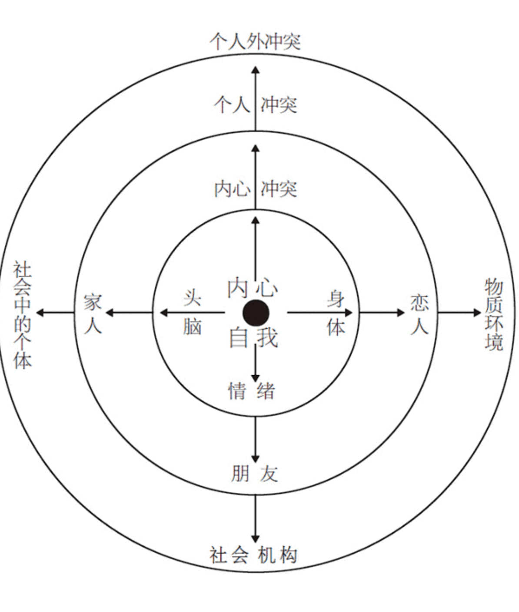
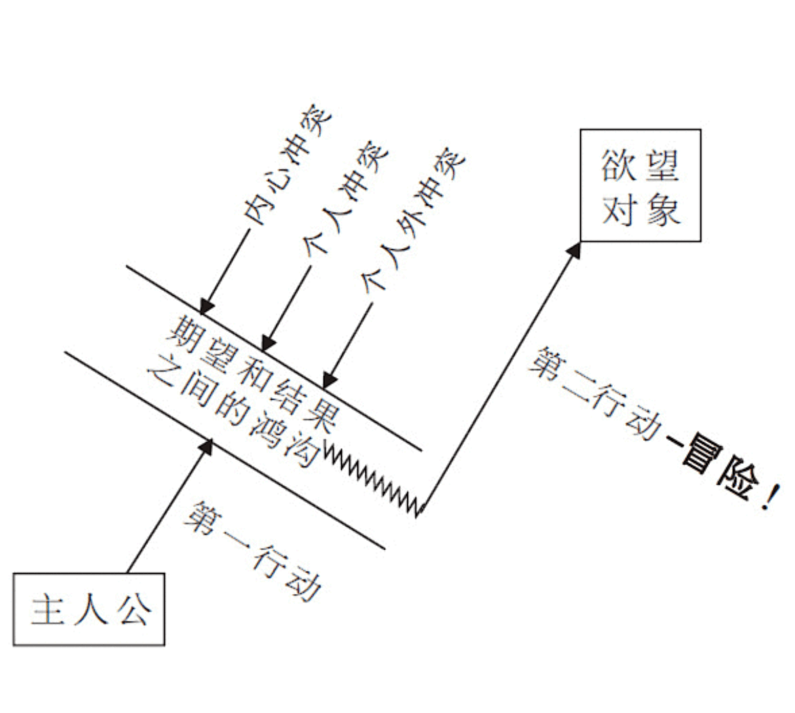
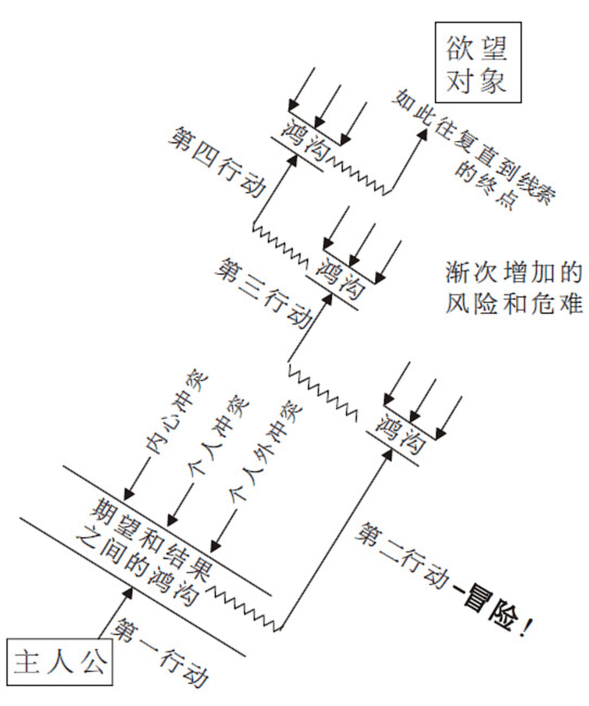

# 故事材质

> 如若强加一个严格的框架，想象力便可被推向极致————并产生最丰富的思想。如若给予完全的自由，作品便可能蔓延无当。When forced to work within a strict framework, the imagination is taxed to its utmost--and will produce its richest ideas. Given total freedom, the work is likely sprawl.
> *T.S.艾略特*

为了理解故事的材质及其工作原理，你需要从里到外去审视你的作品，从你人物的内心，通过人物的双眼去看外面的世界，把自己当作活生生和人物，设身处地地去体验故事的境界。

## 主人公 Protagonist

- 是一个**具有意志力**的人物。其意志力必须**足以在冲突中支撑其欲望**，并最后采取行动来创造出意义重大且同时不可逆转的变化
  - 如果是两个以上的人物构成一个**复合主人公**，必须达到两个条件：
    1. 群体中的所有个体必须**志同道合**，共有同一个欲望
    2. 在一个复合主人公之内，**动机、行为和结果都是共通的**。

  - 如果是**多重主人公**，人物具有各自不同的欲望，各谋其利，各承其害

- 必须具有**自觉的欲望**。主人公具有一个需要或目标，一个欲望对象，而且对此有清楚自知。

- 可以有一个**自相矛盾**的**不自觉欲望**

- 有能力**令人信服地追求**其欲望对象。人物的欲望必须是**现实**的，足以让观众相信，他有能力做到正在做的事情，而且还必须具有达成欲望的**机会**。

- 必须**至少有一次机会达成欲望**，这样才能刺激到观众对主角的成功保持希望。

- 有意志和能力追求其自觉和/或不自觉的欲望，一直到线索的终点，一直到背景和类型所确立的人类极限。
  - 故事的艺术不在于讲述中间状态，而在于讲述人类生存状况的钟摆在两极之间摆动的情形，讲述在最紧张状态下说经历的人生。观众感受到环境的极限，才会抱着希望看到故事的最后。

- 故事必须构建出一个最后动作，让观众**无从想象出另一个更好的可能**。

- 必须**具有移情作用(empathetic)**（和观众自身产生共鸣）；同情作用(sympathetic)（指可爱，我们会喜欢上的另一个人）则可有可无。
  - 你至少**必须让观众移情于你的主人公**，否则观众/故事纽带便断了。

## 观众纽带

观众的情感投入是由**移情作用**而黏合的(the glue of empathy)。如果作者未能在观众和主人公之间接上一根纽带，那我们就会坐在影片之外，感觉不到任何东西。

情感投入与<u>是否能唤起博爱和同情毫无关系</u>。**当我们认同一位主人公及其生活的欲望时，事实上是在为我们自己的生活欲望喝彩。** 通过移情，即通过我们自己和一个虚拟人物之间的同理感受，考验并延伸了自己的人性。故事赐予我们的正是这样的一种机会：去体验我们自己生活以外的生活，去追求、去抗争、去感受我们生存状态的各种不同深度。

同情是可有可无的。一个主人公可以招人喜欢，也可以不是。

## 第一步

你的人物，实际上所有的人物，在追求任何欲望的过程中，在故事的任何时候，总是会采取**从他自己的主观视点来看**最小的保守行动。**所有的人类都是如此。**人性从根本上而言都是**保守**的，实际上这是大自然的规律。任何有机体都只会去消耗必要的能量，<u>绝不会冒不必要的风险或采取不必要的行动</u>。

在生活中，我们经常看到有人或动物表现出似乎没有必要的，甚或愚蠢的极端行为。但这只是我们对其情境的客观看法。从主观上而言，那一生物从经验深处判断，这一明显不合时宜的动作却是最小的、保守的和必要的。**被认为“保守的”东西毕竟都是相对于视点而言的。**

故事和生活之间的重大差异是：在人类的日常生存姿态中，人们采取行动时<u>总是期望得到世界的某种有效反应</u>，而且总能或多或少地得到他们所期望的东西。故事中，这些日常生活的细枝末节则被<u>扬弃</u>。

**在故事中，我们将精力集中于那一瞬间，且仅仅是那一瞬间，人物在那一瞬间采取行动，期望他的世界做出一个有益的反应，但其行动的效果却是引发出了各种对抗力量。人物的世界所做出的反应要么与他的期望大相径庭，要么比他期望的反应更为强烈，要么二者兼有。**

## 人物的世界

一个人物世界中最近的对抗力量圈便是他自己的本体：情感和情绪、头脑和身体。**我们最大的敌人往往是我们自己**。

## 鸿沟

**故事产生于主观领域和客观领域的交接之地。**

在主人公主观期望和客观结果之间、在他采取行动时以为会发生的事情和实际发生的事情之间，在他的或然性感觉和真正的必然性之间，有一道鸿沟。

必然性才是**绝对的真理**。它是我们采取行动时实际发生的事情。只有当我们采取行动，广泛而深入地进入我们的世界并勇敢地面对其反应时————而且也只有在这种时候，我们才能知道这一真理。这一反应便是在那一瞬间关于我们生存状态的真理，无论我们过去曾相信那一瞬间的情况应该如何。**必然性是必须而且实际发生的东西，它与或然性是相对的，后者是我们希望或期望发生的东西。**

生活中如此，小说中亦然。当客观必然与人物的或然性感觉发生矛盾时，虚构的现实里会突然裂开一道鸿沟。这一鸿沟便是主观领域和客观领域的撞击点，是预期和结果之间的差异，是人物在采取行动之前心目中的世界和他在行动中发现的真理之间的差别。

一旦现实裂开这一鸿沟，人物便会以其意志力和能力，感觉到或意识到，他不可能以一种最小的保守方式得到他想要的东西。他必须重整旗鼓，奋力越过这一鸿沟，然后采取第二个行动。这下一个行动是人物在刚开始时不愿意采取的，不仅因为这一行动要求更强的意志力，迫使他更深地挖掘自己的潜能，且最重要的是，第二个行动将使他面临风险。他现在就得去承受有所得便有所失的风险。

## 关于风险

这里有一道简单的测试题，适用于任何故事：风险是什么？如果主人公得不到他想要的东西，他将会失去什么？更具体而言，如果主人公不能达成其欲望，将会发生在他身上的最坏的事情是什么？

如果这一问题得不到令人信服的回答，那么故事的构思在核心上便出了问题。<u>主人公想要的东西没有任何真正的价值，而一个故事如果讲述某人追求毫无价值或价值甚微的东西，那么这个故事便是在给“乏味”下定义。</u>

我们并不仅是将故事作为生活的比喻来进行创作，而是将其作为有意义的生活的比喻来进行创作——**有意义地生活也就是置身于<u>永恒风险之中</u>。**

## 鸿沟内的创造

你必须怀疑表象并搜寻显而易见者的反而。**不要停留在表面**，以其表面价值对事物进行判断；要剥开生活的表皮，找出隐藏的、出人意料的、似乎不合时宜的东西————换言之，即真理。

你就是你宇宙内的上帝。你了解你的人物，他们的头脑、身体、情感、关系、世界。一旦你从一个主观视点创造了一个真诚的瞬间，你便在你的宇宙内四处搜寻，找到另一个主观视点并潜入其中，创造出一个出人意料的反应，并在期望和结果之间劈开一条裂缝。

优秀的写作强调**反应**。

优秀的写作不太强调发生了什么，而是强调发生于**谁、为什么发生**以及**如何发生**。

一旦想象出一个场景，你应该一个节拍一个节拍，一个鸿沟一个鸿沟地写下去。你所写出的东西应该生动地描述出发生了什么、得到了什么反应、看见了什么、说了什么、做了什么。<u>你所写的额东西应该让读者在阅读它时，也会一个节拍一个节拍、一个鸿沟一个鸿沟地体验生活那种过山车般地感觉，就像你在写字台前所体验的一样。</u>

## 故事的材质和能量

一个故事的内容并不是它的话语。话语只是一个手段，一种媒介。**故事的材质是鸿沟，是一个人采取行动时，期望发生的事情和实际发生的事情之间裂开的鸿沟；是期望和结果之间、或然性和必然性之间的断层。**

故事的能源也是鸿沟。
