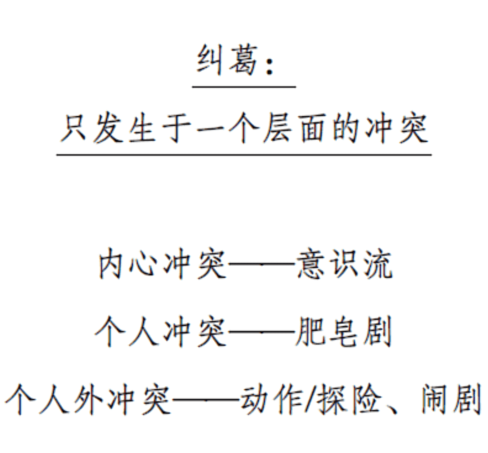
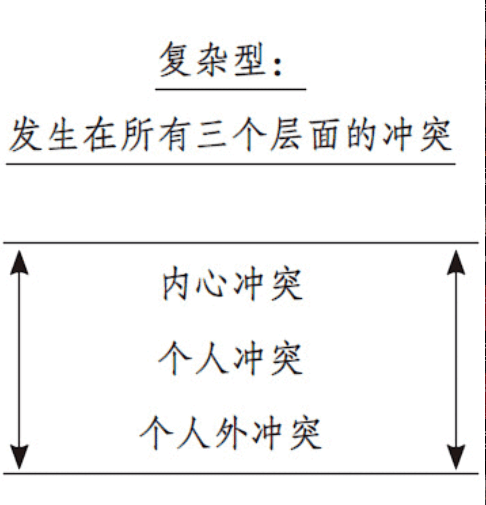

# 幕设计

## 进展纠葛

进展纠葛是指，当人物面对越来越强大的对抗力量时，产生越来越多的冲突，从而创造出一系列逐次发生的事件，经过一个个无法回归的点。

**故事绝不能退隐于轻量级性质或力度的行动，而必须循序渐进地朝着观众无从想象出更好替代的一个最后行动向前运行。**

如果要使影片激流奔涌起伏，**唯一**的方法就是进行研究————想象、记忆和事实的研究。

## 冲突法则

**若无冲突，故事中的一切都不可能向前进展。**

时间艺术家最最艰难地唯一任务就是要勾住我们的兴趣，始终如一地保持我们注意力的集中，然后**带着我们在时间中穿行而又不让我们意识到时间的流逝。**

冲突法则不仅仅是一条审美原理，还是故事的灵魂。故事是生活的比喻，活着就是置身于看似永恒的冲突之中。

**现实的精华就是匮乏，一种普遍而永恒的欠缺。**

> 如果我们想要在短暂的人生中成就点什么，让我们死的时候不存在浪费时间的遗憾，那么我们将会与那些阻止我们欲望的匮乏力量迎面撞上。----马丁·海德格尔

那些不能把握我们短暂人生真谛的作家，那些被现代世界的虚假繁荣所误导的作家，那些相信只要掌握了游戏规则生活便会容易的作家，他们无疑会给冲突投射出一个被曲解的假象。他们的剧本注定会因下面两个原因之一而失败：要么充斥着毫无意义、荒诞不经的暴力冲突；要么缺乏意味深长而又得到忠实呈现的冲突。

前者是动感特技的习作，由那些照搬教科书冲突创作规范的作家写成，但是，由于他们对真诚的人生斗争漠不关心或视而不见，这些作家便炮制出一些虚张声势、暴戾恣睢的苦难托辞。

后者是与冲突本身反其道而行的冗长乏味的肖像式刻画。这些作者一厢情愿地认为，生活其实是美好的……如果没有冲突的话。因此，他们的影片回避冲突，而大肆张扬低调的描写，旨在宣示，如果我们学会更好地沟通，变得更加仁爱，尊重环境，人类便会回归乐园。

但是，如果说历史给我们提供了什么教训的话，那就是，当毒化人心的梦魇终于被清除，当无家可归者都能安居乐业，当全世界完全采用太阳能时，**我们每一个人的烦恼都还会是那样深重且铺天盖地**。

**生活中冲突的数量是一个常量。**冲突的体积是永远不会改变的，它只不过朝另一个方向膨胀而已。如果我们将一个没有冲突的人物生活搬上银幕，这个人物日复一日过着一种宁静而满足的生活，那么观众因厌倦而产生的痛苦将清晰可触。

你若发现自己对头脑、肉体、情感和灵魂的冲突没有兴趣，那么你应该看一看第三世界，看看那里的人类是怎么生活的。

如果内心生活和大世界中冲突的深度和广度不能打动你，那么想想这个：**死亡**。

生活就是关于这些终极问题的提问：如何找到爱和自我价值？怎样才能使内心的混乱归于宁静？以及我们周围无处不在的巨大的社会不平等和时间的一去不复返。**生活就是冲突。冲突是生活的本质。**

**设计相对简单而又复杂的故事。不要增生人物，不要繁殖景点。克制自己去设置一个具有合理限定的人物阵容和世界，并将精力集中于创造一个丰富的复杂型故事。**

## 幕设计

叙事艺术中任何长篇作品都**至少**必须通过三个重大逆转才能到达线索的终点。

- **幕高潮的繁殖容易招致陈词滥调**

- **幕的繁殖会削弱高潮的冲击力并导致重复感**

**每一个故事成分之所以出现于故事之中，是因为它们能够与其他每一个成分发生某种联系。**如果观众找不到这种联系，他们的心神就会游离于故事而去有意识地试图找到一种牵强附会的统一性。如果此举失败，观众就会坐在影院里迷惑不解。
