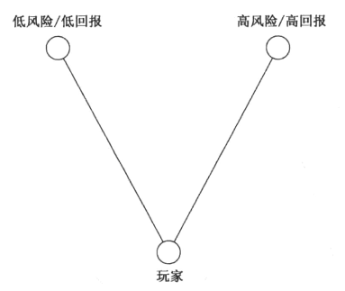

# 第13章 游戏机制必须平衡

## 12种最常见的游戏平衡

**1. 公平**

~~~~
37号透镜：公平

- 我的游戏应该对称（给予所有玩家同等的资源和能力）吗？为什么？
- 我的游戏应该不对称（让双方拥有不同的资源和能力，但是要平衡整个不对称的资源，一半的开发时间应该用来平衡游戏）吗？为什么？
- 以下哪点更重要：我的游戏应能有效地衡量谁的技巧水平最高；或是，我的游戏应该为所有玩家带来有趣的挑战？
- 如果我想要不同水平的玩家一起玩，我会用什么手段，令游戏对所有人都具有趣味性和挑战性？
~~~~

**2. 挑战与成功**

需要平衡挑战与成功两种体验。


- 随着每次成功增加难度
- 让玩家快速打通容易的部分
- 创建“层层挑战”
- 让玩家自选难度级别
- 请各种玩家进行试玩（熟练玩家及新手玩家）
- 让失败者休息一下（给落后玩家更好的奖励）

~~~~
38号透镜：挑战

挑战是几乎所有游戏玩法的核心。

- 我的游戏中的挑战是什么？
- 它们是太容易，太难，还是刚刚好？
- 我的这些挑战能否容纳各种各样的技巧水平？
- 随着玩家不断成功，挑战难度如何增长？
- 挑战的种类是否足够多样？
- 我的游戏中最高水平的挑战是什么？
~~~~

**3. 有意义的选择**：好游戏给玩家的选择是有意义的。

若你发现制作的游戏中有一种最优策略，一定要改变规则（调整平衡），使之丧失最优地位，在游戏中恢复有意义的选择。

我们应该给玩家多少有意义的选择？

- 如果选择>欲望，玩家会感到不堪重负
- 如果选择<欲望，则玩家感到沮丧
- 如果选择=欲望，则玩家感觉自由满足

~~~~
39号透镜：有意义的选择

- 我要求玩家做何种选择？
- 这些选择有意义吗？怎么做呢？
- 我给玩家的选择数量对吗？加多些，是否让他们更有力量感？减少华夏幸福 ，是否让游戏变得更清晰？
- 我的游戏中是否有最优策略？
~~~~



~~~~
40号透镜：三角形

- 我的游戏中有三角形了吗？如果没有，怎样才能有呢？
- 我尝试构造的三角形平衡吗？换言之，回报与风险成比例吗？
~~~~

**4. 技巧与概率**

平衡技巧和概率的一种常见方法，就是在游戏中交替使用概率和技巧。

~~~~
41号透镜：技巧与概率

- 我的玩家是来接受评断（技巧）的，还是来冒风险（概率）的？
- 技巧一般比概率更严肃：这是个严肃的游戏，还是休闲游戏？
- 我的游戏有没有乏味的部分？如果有，加入概率元素能盘活它吗？
- 我的游戏中有没有感觉太随机的部分？如果有，将概率元素替换为技巧或策略元素，能让玩家感觉控制感更强吗？
~~~~

**5. 头与手**

游戏中应该有多少部分包含挑战人的身体活动（无论是转向、投掷、或敏捷地按键），又有多少应该包括思考呢？

了解你的目标市场喜欢游戏中出现什么很重要————思考更多，还是敏捷更多？

~~~~
42号透镜：头与手

- 我的玩家想要无脑运作，还是智力挑战？
- 在游戏里更多地方包含解谜，会更加有趣吗？
- 有没有地方可以让玩家放松大脑，只管玩，不用想事情？
0 我能不能给玩家一个选择————可以展示高度敏捷，也可以找到一个最不需要身体技巧的聪明策略？
- 如果“1分”是纯身体，“10分”是纯精神，我的游戏得几分？
~~~~

**6. 竞争与合作**

~~~~
43号透镜：竞争

- 我的游戏对玩家技巧高低的衡量公平吗？
- 人们是否想赢得我的游戏？为什么？
- 在这个游戏中获胜是可以自豪的事情吗？为什么？
- 新手可以在我的游戏中有意义地竞争吗？
- 专家可以在我的游戏中有意义地竞争吗？
- 专家们是否普遍肯定他们会打败新手？
~~~~

~~~~
44号透镜：合作

- 合作需要沟通，我的玩家有足够契机来沟通吗？如何加强沟通？
- 我的玩家们已经是朋友，还是陌生人？如果他们是陌生人，能帮助他们破冰吗？
- 玩家们合作时有协同作用（2+2=5）或妨碍作用（2+2=3）吗？为什么？
- 玩家们都是相同角色，还是各有特殊分工？
-如果只靠一个人无法完成某项任务，就能大大加强合作。我的游戏有此类任务吗？
- 强制沟通的任务会激发合作，我有强制沟通的任务吗？
~~~~

~~~~
45号透镜：竞争与合作

- 如果“1分”是竞争，“10分”是合作，我的游戏得几分？
- 我能不能让玩家选择，是合作还是竞争？
- 我的受众喜欢竞争、合作，还是两者混合？
- 团队竞争适合我的游戏吗？我的游戏中，是团队竞争好玩，还是单人竞争好玩？
~~~~

**7. 短与长**

每个游戏都有一个重要的点需要平衡：游戏长度。

确定游戏何时结束的最主要因素就是胜败条件。

**8. 奖赏**

- 赞美
- 分数
- 延长游戏
- 入口（新区域或新关卡）
- 演出（音乐或动画）
- 表现（特殊装饰）
- 能力（让玩家用更快的方式到达目标）
- 资源
- 地位
- 完成（开启成就）

给玩家的奖励应该给多少？给哪些？以下有2个窍门：

- 人们有一种倾向，收到越多奖励就感觉越习以为常。解决方法是：随着玩家游戏进度的推进，增加奖励价值。

- 变化的奖励比固定奖励更有力量。

```
46号透镜：奖励

- 我的游戏现在给出哪些奖励？我还能给出其他的吗？
- 玩家在我的游戏中得到奖励后，是激动还是无聊？为什么？
- 收到奖赏却不理解，如同根本没有奖赏。我的玩家理解他们收到的奖赏吗？
- 我的游戏中送出的奖赏是不是太有规律？能不能用更多变的方式送出呢？
- 我的奖励之间有何种联系？有没有办法让它们连接得更好？
- 我的奖励逐渐累积的方式如何？太快，太慢，还是正好？

```

设计师还要考虑送出的时间对不对，量是否合适。这只能通过试错来确定。尝试调整奖励平衡很难做到完美————经常要安心于“足够好”。

**9. 惩罚**

惩罚的好处：
- 创造内生价值
- 冒险激动人心
- 可能的惩罚增加挑战

一些常见惩罚类型：
- 羞辱
- 失分
- 缩短游戏
- 中断游戏
- 倒退：难点在于精确地确定存档点放在哪里，才能让这种惩罚感觉有意义，而非毫无道理。
- 剥夺能力
- 消耗资源

**在游戏中所有处罚都应当是玩家能够理解的、可以防止的，这一点至关重要。**如果玩家感觉惩罚是随机的，而且阻止不了，就有一种完全无法控制的感觉，这非常不好。

~~~~
47号透镜：惩罚

惩罚一定要小心使用，毕竟玩家们是自主主动来玩游戏的。适当平衡的惩罚可以让你游戏中的一切更有意义，玩家在其中成功后也会有真正的自豪感。

- 我的游戏中有什么惩罚？
- 我为什么要惩罚玩家？我希望通过它来实现什么？
- 我的惩罚在玩家看来公平吗？为什么？
- 有没有办法把这些处罚改为奖励，并收到同样或更好的效果？
- 我的强力惩罚，有没有相应丰厚的回报来平衡？
~~~~

**10. 自由体验与受控体验**

每个游戏设计师都必须考虑的一种简单游戏平衡就是在哪里给玩家自由、给多少自由。

**11. 简单与复杂**

- **固有的复杂性**：游戏规则本身很复杂

- **自发的复杂性**：由简单的规则可允许组合形成的复杂

~~~~
48号透镜：简单/复杂

- 我的游戏有什么元素是固有复杂的？
- 有办法令这种固有的复杂性可以变成自发的复杂性吗？
- 我的游戏中是否以产生自发的复杂元素？如果没有，为什么？
- 我的游戏中是否有些元素太过简单？
~~~~

> 如果剧本中有一行的目的不足两个，就该砍掉。

~~~~
49号透镜：优雅

- 我的游戏有哪些元素？
- 每个元素的目的是什么？全部数出来，给每个元素一个“优雅评分”。
- 有的元素只有一个或两个目的，能否合并一些或干脆删除？
- 有的元素有多重目的，能否让它们承担更多目的？
~~~~

~~~~
50号透镜：性格

优雅和性格是对立的，它们就像缩小版的简单与复杂，也必须保持平衡。要确保你的游戏有些可爱的怪地方能定义其性格。

- 我的游戏里有没有奇怪的东西，玩家会激动地讨论它们？
- 我的游戏有没有好玩的特性，令其与众不同？
- 我的游戏里有没有玩家喜欢的缺陷？
~~~~

**12. 细节与想象**

- **只做能做好的细节**：如果有你想表现的东西，但质量不如玩家能想象的高，那就别做。

- **给出供想象力使用的细节**：给出任何能让游戏更易理解的细节，都很讨喜。

- **熟悉的世界无须太多细节**

- **运用望远镜效应**

- **给出激发想象力的细节**

~~~~
51号透镜：想象力

- 要玩我的游戏，玩家必须明白什么？
- 用一些想象元素能帮助也们更好地理解吗？
- 在这个游戏中，我们提供哪些同质量、真实的细节？
- 哪些细节，如果我们提供的话，质量会低？可以改用想象力来填补差距吗？
- 我能给出些细节，让想象和一次又一次来使用？
- 我提供的哪些细节能激发想象力？
- 我提供的哪些细节会扼杀想象力？
~~~~

## 游戏平衡方法论

- **使用问题陈述透镜**：设计师要先想清楚问题究竟是什么，再去执行平衡方案。

- **加倍和减半**：你修改东西，要能马上感到实际发生差别。这能让你清晰地理解你修改的数值是如何在游戏中运作的，免得你一直怀疑自己的修改到底生效没有，乱摸乱撞。

- **通过精确猜测训练你的直觉**：游戏设计得越多，你的直觉就会越强。

- **记录你的模型**：你应该在调整平衡时，把考虑的事物间的关联写下来，这有助于澄清你的想法，并能给你一个框架来记录游戏平衡实验的结果。

- **调整游戏的同时调整模型**

- **计划好平衡**：最好能有一个内容管理系统，可以持续调整平衡。

- **交给玩家**：游戏平衡最好还是留给设计师调整。

### 平衡游戏经济

平衡游戏经济需要考虑的问题：
- **公平**：有玩家会通过买特定的东西或以特定方式获利，得到不公平的优势吗？
- **挑战**：有玩家能买到一些东西，令游戏对他们来说太容易吗？挣钱来买他们想要的东西会太难吗？
- **选择**：玩家有足够的方式赚到钱吗？花钱呢？
- **概率**：赚钱更基于技能还是概率？
- **合作**：玩家能以有趣的方式集资吗？他们可以利用经济中的“漏洞”共谋吗？
- **时间**：赚到钱花费的时间是否太长或太短？
- **奖励**：赚钱这件事有奖励感吗？花钱呢？
- **惩罚**：惩罚如何影响一个玩家挣钱和花钱的能力？
- **自由**：玩家能以希望的方式买到想要的东西吗？

~~~~
52号透镜：经济系统

- 我的玩家可以怎样赚到钱？还应该有其他方式吗？
- 我的玩家可以买什么？为什么？
- 钱会来得太容易吗？太难吗？怎样改变呢？
- 有关赚钱花钱的选择有意义吗？
- 在我的游戏里做一种通用货币是好主意吗？还是应该有特殊货币呢？
~~~~

~~~~
53号透镜：平衡

- 我的游戏感觉对吗？为什么对？为什么不对？
~~~~
