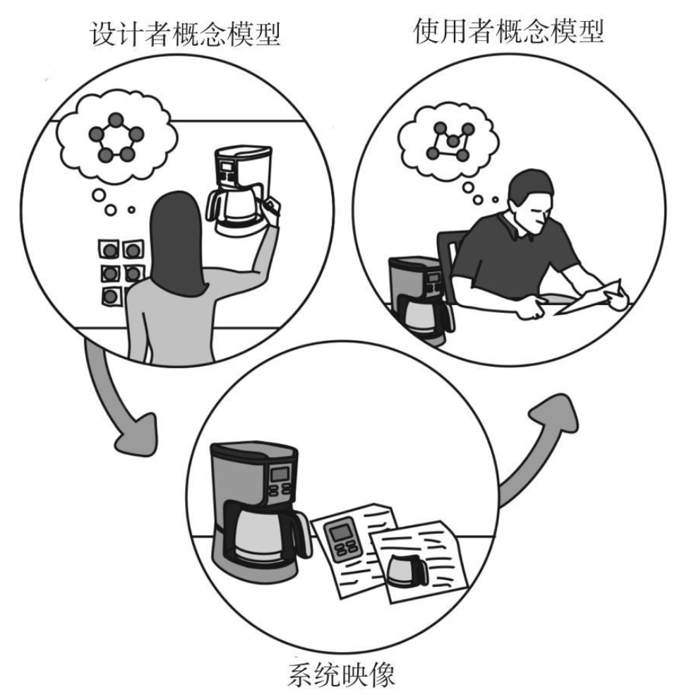

# 日用品心理学

### 好设计的特征

- **可视性(discoverablility)**：让用户明白怎样操作是合理的，在什么位置及如何操作
- **易通性(understanding)**：设计的意图是什么，产品的预设用途是什么，所有不同的控制和装置起到什么作用

### 几类相关设计的基本定义

- **工业设计**：一种专业服务，为使用者和生产者双方的利益而创造和开发产品与系统的概念和规范，旨在**优化功能、价值和外观**。
- **交互设计**：重点关注人与技术的互动。目标是**增强人们理解可以做什么，正在发生什么，以及已经发生了什么。**交互设计借鉴了心理学、设计、艺术和情感等基本原则来保证用户得到积极的、怜悯的体验。
- **体验设计**：设计产品、流程、服务，以及事件和环境的实践，重点关注**整体体验的质量和愉悦感**。

**我们必须接受人类行为的本来方式，而不是我们希望它应有的方式。**

### 以人为本的设计

**良好的设计起始于对心理和技术的理解。**

以人为本的设计是一种设计理念，意味着设计以充分了解和满足用户的需求为基础。这处理解主要通过观察。**人们往往并不知道自己的真正需求，也不清楚他们将要面对的困难。**

因此，以为人本的设计原则就是**尽可能地避免限定问题，然后不断地反复验证，寻找问题的真相。**解决方法就是快速测试不同的概念，每次测试后都有所改进，从而找到总是所在，产品最终才能真正满足用户需求。

### 交互设计的基本原则

- **示能(affordance)**
  - 指一个物理对象与人之间的关系，揭示人与机器之间进行互动的可能性。示能是物品的特性与决定物品预设用途的主体的能力之间的关系，传达出有形物品如何与人类互动的信息。
  - 示能的体现，由物品的品质同与之交互的主体的能力共同决定的。它的可见性非常重要，可见的未能对操控提供了有力线索。
- **意符(signifiers)**
  - 示能的符号提示功能，一个信号。指能告诉人们正确操作方式的任何可感知的标记或声音。
  - 意符必须是可感知的。
- **映射(mapping)**
  - 表示两组事物要素之间的关系。
  - 如果能清楚理解控制、行为和预期结果之间的映射，控制和结果之间的关系最容易了解。
  - **当一系列可能的操作是可见的，当控制和显示契合自然映射时，设备就会容易使用。**
- **反馈(feedback)**
  - 反馈必须是即时的。
  - 反馈必须提供信息。
  - 过多的反馈比过少的反馈更烦人。
  - 反馈必须考虑优先权，以不经意的方式表现不重要的信息，使用引人注目的方式呈现重要的信号。
- **概念模型(conceptual models)**
  - 概念模型通常是高度简化的说明，告诉你事物是如何工作的。概念模型只要有用就行，不必完整或准确。
  - 也被称为"心理模式"，即在人的心目中，所理解的事物如何动作的概念模型。
  - 事物如何操作的主要线索，来自它们可被感知的结构——尤其是意符、示能、约束和映射。
  - 当预测事情将如何进行，或者当事情不按计划而需要搞清楚问题时，概念模型非常有用。**一个好的概念模型使用户能够预测自己行为的结果**。没有一个好的概念模型，只能生搬硬套盲目操作；用户可能遵循已经知道的方法操作，但无法完全理解为什么，预期的效果是什么，或者事情出错了该怎么办。
  - 当概念模型向用户提供的是不充分或者错误的信息时，用户就有麻烦了。
- **系统映像**
  
  - 提供给用户的适用信息组合叫"系统映像"。当系统映像是不相干的或不合理的，用户就不能轻松地使用设备。
  
    
  
  - 无论产品多么辉煌，如果人们无法使用，就会得到差评。由设计师提供适当的信息使产品易于理解和好用，最重要的是**提供一个好的概念模型**，当事情出问题时能指导用户操作。
  
  - 良好的概念模型是产品易于理解、令人愉悦的关键：良好沟通是建立良好的概念模型的关键。
  
  

