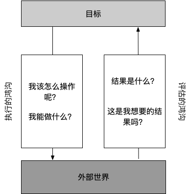
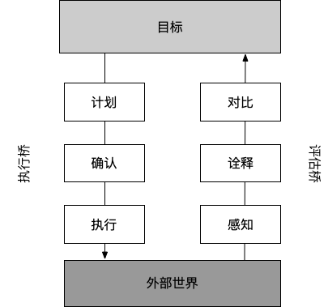
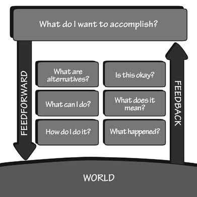

# 日常行为心理学

### 三个关键问题

- **人们如何做事？**
- **当事情出错了怎么办？**
- **我们要怎么做？**

### 人们如何做事：执行与评估的鸿沟

当用户使用物品时，他们会面对两个心理鸿沟：

1. 执行的鸿沟，用户试图弄清如何操作

2. 评估的鸿沟，试图弄清楚操作的结果

评估的过程反映了努力的程度，人们必须对设备的物理状态做出解释，以便确定是否已达到自己的期望和意图。**当设备以方便的形式提供了它的状态信息，而且容易阐释，符合用户认知系统的方法，那么评估的沟壑就小。**

帮助消除评价沟壑的主要设计元素是：

- **反馈**
- **一个很好的概念模型**

### 行动的7个阶段

1. **目标(确立意图)**
2. **计划(确定方案)**
3. **确认(行动顺序)**
4. **执行(实施行动)**
5. **感知(外部世界的状态)**
6. **诠释(知觉作用)**
7. **对比(目标与结果)**

行动类型：

1. 行动起源于建立一个新的目标，称为**目标驱动型**，行动周期从设立目标开始，然后结过执行的三个步骤。
2. 行动起源于外界世界的事件，称为**数据驱动/事件驱动型**，行动周期从外部世界和周围环境开始，结过评估的三个步骤。
3. 目标和意图并不明确，没有预备，随机应变，称为**机会主义型**。机会主义行动少了准确和肯定，但它们**减轻了人们的心理负担，不会带来不方便，或许还更吸引人。**

行动的七个阶段为开发新产品或服务提供指导，**用户从一开始就有明显的心理鸿沟，不论是执行的鸿沟还是评估的，每条都是改进产品的机会。**诀窍是要**培养洞察力**。

### 人的思想：潜意识主导

为什么我们需要了解人类的思维？因为**产品是为们的使用而设计的，如果不能深入了解人，设计往往会失败，产品将难以使用，难以理解。**

大脑是根据外部世界来建构的，每个行动都承载着它的期望，这些期望影响着情绪。这是为什么很多语言是基于形体隐喻，为什么人体及其与环境的相互作用是人类思维的重要组成部分。

人们极其低估了情感的作用。事实上，情感与认知一起工作，是功能强大的信息处理系统。认知试图搞清楚这个世界，情感则赋予其价值。无论正在发生的事情是好是坏，令人满意或不满意，情感体系判断环境安全或是带有威胁。**认知提供理解，情感提供价值判断**。

我们通常在事后运用意识去解释潜意识做的事。

积极情绪对创造性思维是理想的，但它并不是非常适合做事。如果积极情绪太多，我们会觉得浮躁，会轻易从一个话题转到另一个话题，在一个想法未完成之前，另一个想法就出现了。消极情绪下，大脑会全神贯注，集中注意力在一个任务上，并完成它。如果消极情绪过多，就会目光短浅，思维狭隘，这时人们无法超越自己。

| 潜意识           | 意识                                     |
| ---------------- | ---------------------------------------- |
| 迅速             | 缓慢                                     |
| 自发地           | 受控地                                   |
| 有多种来源       | 限定的来源                               |
| 控制着熟练的行动 | 当学习、碰到危险和出错时，对新状况产反应 |

### 人的认知和情感

**大脑处理信息的三个层次**：

1. **本能层次**
   - 完全潜意识
   - 事物的外在表现触发本能反应
   - 只关于吸引和厌恶
   - 产品的外观和美学
2. **行为层次**
   - 潜意识为主
   - 最重要的是，**让每一个行动都与一个期望相关联。**如果期待一个积极的结果，其结果就是一个积极的情感反应，反之亦然。
   - 行为状态是可以习得的。当对行为的结果有很好的了解和预知时，就会产生控制感。当事情无法按计划进行，尤其不知道理由也没有可能的补救措施时，会产生挫折感和愤怒。
   - **缺乏反馈会导致失控的感觉，这会让人不安。**反馈是管理预期的关键。
   - 释放期望带来的紧张感会创造一种如释重负的感觉。情感系统对状态的变化尤其敏感。
3. **反思层次**
   - 认知的，产生推理和有意识决策的，有深度而缓慢的。
   - 通常在事后发生。
   - 对设计师来说是最重要的过程。

### 行为的7个阶段和大脑的3个层次

**概念模型是一种形式的故事，来自我们习惯寻找解释的天性。**在帮助我们理解自己的经验，预测自己的行为结果，以及处理突发事件时，这些模式就变得非常重要。**我们基于自己已有的知识建构自己的模式，无论是真实的还是想象的，天真的还是复杂的。**

### 习得性无助(learned helplessness)

指人们在做某事时多次经历失败，便认为自己实在无法做好这件事，结果陷入无助的状态，不再进行尝试。若是经常遇到这种情况，人们就会产生严重的心理障碍。

设计上的失败会导致人们产生习得性无助。

### 积极心理学

- 当用户不能正确使用你的产品时，不要责怪他们
- 把用户遇到的困难当作产品改善的机会
- 消除电子设备或计算机系统的所有错误信息，而不是提供帮助和指导
- 直接从帮助和指导信息中纠正总是，让用户能继续使用产品：不要让用户重新开始
- 假设用户所做的不完全是正确的，如果有不恰当的地方，提供指导，使他们能纠正问题，找到正确的方式
- 面对你自己和要打交道的人，积极地思考

**如今，我们坚持认为人应该有优异表现，以适应机器的特殊要求，其中包括总是提供精确的、准确的信息。但是人类正好不擅长这个方面，可是，当人们不能满足机器任意的不人道的要求时，我们称之为人为差错，不，它是设计的差错。**

##行动的七个阶段：七个基本设计原则

1. 想实现什么?
2. 可能替代的动作序列是什么？
3. 现在能做什么？
4. 该怎么做？
5. 出什么事了？
6. 这是什么意思？
7. 做好了吗？已经达到目标了吗？

**使用产品的用户都应该能够得到所有七个问题的答案。**

有助于回答执行类的信息叫前馈(feedforward)，有助于理解发生了什么的信息叫反馈(feedback)。**知道你能做什么，这是前馈的作用。**

前馈和反馈都需要以用户容易阐释的形式来呈现。其表现形式应该符合人们看待达成目标和预期的方式。**信息必须符合人的需要。**

### 设计的7个基本原则

1. **可视性**：让用户有机会确定哪些行动是合理的，以及呈现该设备的当前状态
2. **反馈**：关于行动的后果，以及产品或服务当前状态的充分和持续的信息
3. **概念模型**：引导用户理解系统状态，带来掌控感。概念模型同时包括可视性和评估行动的结果
4. **示能**：设计合理的示能，让期望的行动能够实施
5. **意符**：有效地使用意符确保可视性，并且很好地沟通和理解反馈
6. **映射**：使控制和控制结果之间的关系遵循良好的映射原则
7. **约束**：提供物理、逻辑、语义、文化的结束来指导行动，容易理解

> 除非你做得更好，否则不要批评。

要尝试了解设计的错误是如何发生：尝试确定别的方式可不可以做到。要反复权衡不良设计的原因和可能的改良方法。下次碰到一个精心设计的物品，在初次尝试时就很好用，毫不费力，这时你要停下来，好好研究。想想它如何很好地运用了行动的七个阶段以及相关设计原则。

我们与产品的互动，大多数情况下是与一个复杂的系统进行交互作用：优秀的设计需要考虑整个系统，以确保用户的需求、意向和每个阶段的要求都被忠实地理解，并在所有其他阶段都得到尊重。

