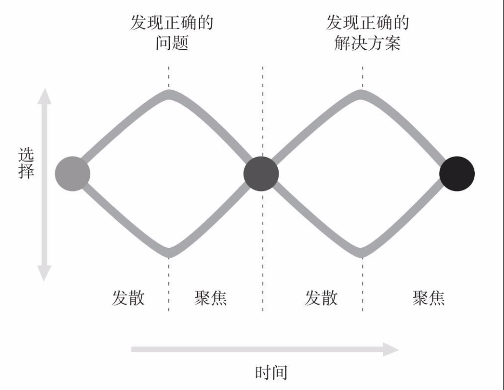

# 设计思维

> 不去解决问到我的问题。

在现实世界里，问题不会像学习材料那样亲切友好、干净整洁地来到你面前，**你需要探究问题的来源。**你仅仅看到表面现象，从来不深究真正的问题所在，这样太容易了。

优秀的设计师不会一开始就着手解决丢给他们的问题：他们会先努力理解真正的问题是什么。因而，设计师首先不是聚焦于解决方案，而是发散式思考，先做用户研究，搞清楚要实现什么，产生一个又一个新点子。

### 设计思维（design thinking）定义

把原始问题作为一种建议，理解潜藏在问题背后真正的深层因素，确定真正的、根本的问题所在，再想想再充分的潜在方案，最后得出新的建议。

### 设计思维的2大工具

- **以人为本的设计思想**

  - 确保满足用户的需求，设计出的产品具有易用性和可理解性，能够完成期待中的任务，并且拥有积极和愉悦的用户体验。
  - 强调两个方面：
    - **解决正确的问题**
    - **采用满足用户需求和能力的恰当方式**
  - 设计流程：
    1. 观察
       1. 初步理解问题的本来面目，找到潜在用户，观察他们的行为，试图理解他们的兴趣爱好、动机及真实需求
       2. 传统方法衡量人群得到的数据，比如年龄、教育和收入等，并非经常很重要：**我们最关注的是将要完成的行动**，研究应当注重行动，以及它们如何被实施，同时观察本地环境和文化如何影响并改变行动**
       3. **没有什么能够替代直接观察、同产品的未来使用者互动等有效方式**
    2. 激发创意(构思)
       1. 激发足够数量的创意
       2. 不要受限
       3. 质疑每一件事
    3. 打样
       1. 制作模型**主要是确保很好地理解问题**
    4. 测试
       1. 用户测试样本上限最好为5人

- **发散--聚焦设计模式**

  - 扩大问题的范围，进一步分别检测问题下隐藏的根本原因
  - 聚焦于其中某一个问题的描述
  - 研究制定解决方案时，扩展可能的方案，再进行一次发散思考的过程
  - 整合出一个合适的方案

  

### 设计调研与市场调查

- **市场调查**
  - 市场调查关注：
    - 谁可能购买产品？
    - 什么因素促使他们考虑和购买产品？
  - 市场调查经常使用大批量定量研究，主要依赖于分组讨论、问卷调查等方式
- **设计调研**
  - 设计调研关注：
    - 用户真实的需求

> 当人们被问到他们需要什么，他们首先会想到日常面临的问题，很少注意到存在更大的问题、更关键的需求。他们不会质疑正在使用的主流方式。此外，即使他们详细解释自己如何完成任务，当你将这些演示给他们看，他们会承认你抓住了要点，但当你观察他们，经常会发现他们的行为与他们所描述的不一致。

### 以活动为中心的设计与以人为本的设计

强烈关注个体用户的设计理念，是以人为本的设计思想的标志。

关注操作，而不是单个用户，被称为**以活动为中心的设计(activity-centered design)**。让操作方式来定义产品和结构，依据操作的概念模型来建立产品的概念模型。

以活动为中心的设计是以人为本设计方法的加强和补充。

### 任务与活动的区别

**必须为活动而设计 ，为任务而设计通常存在太多约束。**

为个人所做的设计，结果可能对一部分特定的目标人群非常出色，但与其他的人并不相配。为活动而设计，其结果适用于每一个人。主要的好处还在于：**如果新的设计要求与用户的活动相一致，用户会容忍复杂和新的要求，去学习新的东西：只要适应了任务，掌握了复杂和新的要求，用户会感到自然，认为这都是合理的。**

**最好的办法是循环往复和阶段评审结合在一起。延迟对产品需求进行精确定义，直到对快速样品的反复测试结束，同时保持对时间计划、预算和质量进行严格控制。**

### 唐·诺曼的产品研发守则

将设计和产品团队分开：**让设计调研者时常处于现场，一直研究潜在的产品和用户。**

设计师不辞辛苦，确认用户的真正需求，然后去实现它们，而市场关心影响人们实际购买产品的那些要素。**用户的需求和他们购买什么产品是两件不同的事情，但都很重要。**如果无人购买，再伟大的产品都毫无意义。

设计师除了考虑产品使用者的需求，还需要考虑参与产品生产制造流程其他团队的要求。

一定要有一个跨部门的团队，管理整个设计、工程和生产过程，从项目开始第一天起，分享所有部门的问题和疑惑，这样每个人都参与设计，满足各自需求。

设计工作如此具有挑战性的原因在于，设计方案必须同时考虑销售和市场，服务和支持，工程和生产，成本和时间。

给特殊人群设计产品时需要考虑人的面子问题。

