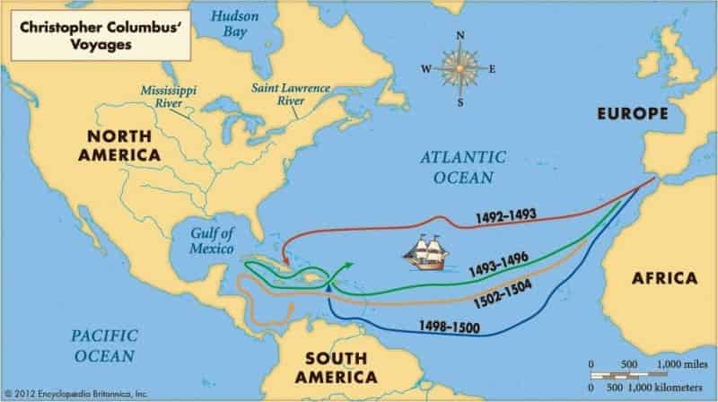
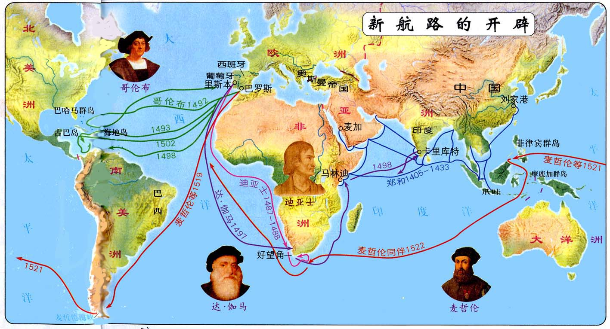
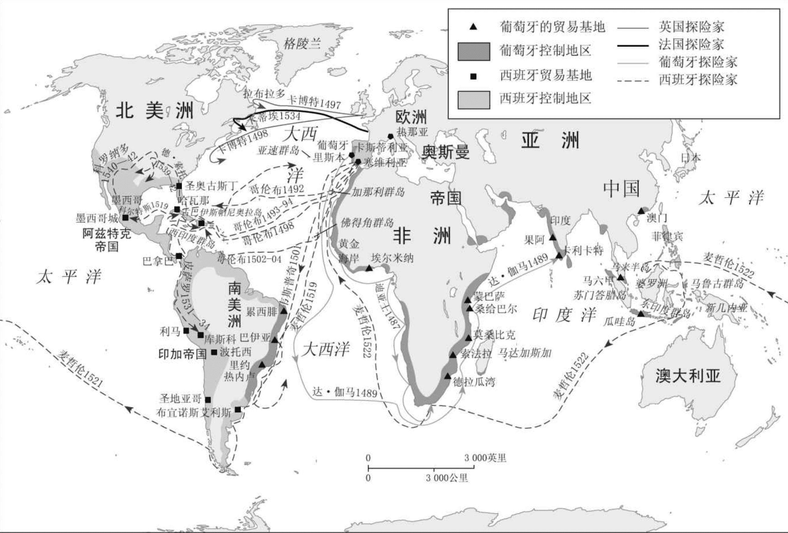

**中世纪**：5世纪～15世纪

## 经济、统治及人口

**一个影响历史的人及家族：雅各布·富格尔，利用借贷业务向中欧各国统治者提供巨额贷款，推动了欧洲各国经济发展，推动了文艺复兴的形成，影响了贸易路线的扩张。**

16世纪初，人口增长（农业产量的小幅增长促成）促进了欧洲贸易的复兴，弥补了14世界中叶黑死病造成的灾难性损失。

某种程度上来说，欧洲在16世纪初的四分五裂由这个地区存在的**民事法**（来自罗马法，统治者颁布并裁定）、**教会法**（教会创立由教会裁定）和**习惯法**（将约定俗成的习俗编撰成，各地法官单独裁定，由封建习俗发展出来）导致的。

欧洲政治上的分裂伴随着文化上的分裂，不同的语言进一步强化了彼此文化的不同。

1054年罗马帝国灭亡，基督教分裂为**罗马天主教**和**东正教会**。

从罗马帝国灭亡开始，教会就是一个集权的宗教权力机构，

**奥斯曼帝国**，1299年～1923年，15世纪～19世纪唯一能挑战欧洲基督教国家的伊斯兰势力。

奥斯曼帝国的君主苏丹独掌宗教和政治的最高权力，且他的领主们有独立于都会权力的自治权，<u>教皇要求他们的主教和其他神职人员忠于世俗国家的统治者。</u>

中世纪开始，西方基督徒开始试图夺回被穆斯林征服和土地，<u>从1095年~1270年间，总共发动8次“十字军东征”</u>，对他们认为是异教徒的国家发动持续的宗教战争。

### 社会结构

中世纪社会简单分为三大社会团体：

1. 神职人员：负责安排人心
2. 贵族：管理事务并参战
3. 农民：种粮食

### 封建制度

为了应付早先的社会动荡及无政府状态，出现了**封建时代的权力结构（国王、领主、封臣、农民）**。封建制度是一种强大的人从相对较弱的人那里榨取赋税或劳役的体制。

14世纪中叶的黑死病消灭了西欧1/3到1/2的人口，领主们试图重建封建制度时，遭到农民大起义，国家利用骚乱征收新税，加强权力，促进了封建时代的结束。

**西欧的统治者鼓励农民自由运动，这样让领主对农民的控制减弱，也可以让自由的农民缴税。**

随着商业家族变得越来越富，他们开始购买土地和贵族头衔。**在每个国家，商人阶级都变得重要起来。**

16世纪的欧洲人，大部分寿命极为短暂。预期寿命大约40年，婴儿大约1/5会在1岁之前夭折。100个新生儿里1/2能够活到20岁，再1/5能够活到40岁。

大部分城镇，死亡率高于出生率。遗弃新生儿很普遍，节欲习俗限制出生率，夫妇一方经常过早死亡，普遍晚婚也是制约因素之一。婚姻往往是包办，妻子在收入管理者和劳动者双重身份下有最低限度的平等地位。

**出轨违背了人们的公正观，因为当时人们认为夫妇双方彼此忠实于对方并相互履行自身义务很重要。**

##贸易发展

13世纪威尼斯和意大利其他城邦的银行业家族已经建立起相当完备的银行体系。

贸易的发展促进了从事商业和手工业人员的增加，从而出现了行会和学徒制度。

1450年～1550年，行会垄断并规定工资，促成制造环节外包的出现，农村家庭手工业迅速在意大利北部、尼德兰、法国北部和英格兰发展起来。

**经济的发展和治安的改善导致城镇数量增多。**

**如今欧洲大部分重要城镇在1300年（14世纪初）就已建立。**

牛津和剑桥大学在13世纪建立。

封建时代的欧洲，城镇是自由的象征，因为那里的居民在大多数情况下不需要为领主承担各种义务。城市的自由权首先必须从贵族领主那获得，城镇通过购买免税特许状来获取其他方面的收入。

**国王权力相对薄弱的地区，如意大利和德意志邦国，城镇有最大限度的自由。反之，城镇发展则相对缓慢。**

西欧地区，如英格兰、法国北部、荷兰、佛兰德（比利时西部一个地区）、瑞士，坚持为了自身的独立权利，与统治者、乡村贵族作斗争。

东欧的城镇缺乏西欧城镇的基础协会组织，无法遏制贵族权力的强大，没有获得西欧城市的特权。

17世纪以前，东欧和中欧东部地区频发的战争都阻碍了这两个地区出现强大的集权国家。

15世纪时，欧洲各国间开始建立常规外交，意大利城邦最先开始交换永久定居外交使节。

**统治者的权力依旧受到相当大的限制。限制来自**：

- 购买了财政豁免权的城镇居民
- 距离王都很远的地区
- 贵族议会
- 提供贷款的银行家族
- 贵族和神职人员本身，拒绝交税
- 教皇

## 科技、战争及文化

火药促进了枪炮的诞生，战争更频繁，死伤人数更多，战争从小打小闹发展为国际争斗。

13世纪阿拉伯人通过西班牙把雕版印刷术和纸传到欧洲，15世纪，佛兰德工匠发明了一种油基墨和手动印刷机。1450年，德国人约翰内斯·古腾堡发明了金属活字印刷机。

印刷业的发展让思想舆论控制变得更困难。

#### 对外扩张

1415年葡萄牙人在摩洛哥海岸站稳脚跟，目标是打破穆斯林和威尼斯人的垄断，寻找欧洲人获得亚洲丝绸和香料的新航线。

1492年，西班牙国王害怕葡萄牙商船可能会抢先到达富裕的亚洲，同意支持哥伦布的探险。哥伦布认为地球是圆的，所以不能往非洲绕过去，就一直往西就能到达东方，于是发现了美洲。由于没有找到黄金，他建议西班牙王室可以靠贩卖当地人为奴隶获利。

1487年迪亚士首次达到非洲最南端，并绕过好望角，进入印度洋海域。

1498年，葡萄牙探险家达·伽马运载着香料从印度回到葡萄牙，葡萄牙人沿着印度洋建立起一条海上航线，并发现了亚洲海上贸易网。

1493年，教皇亚历山大六世把非基督徒的世界划分给西班牙和葡萄牙，为这两个国家征服战争的行为正名。**教皇把非洲撒哈拉沙漠以南地区和亚洲给了葡萄牙，西班牙得到美洲大部分土地。后葡萄牙夺走巴西，使巴西在16世纪下半叶成为美洲最大的殖民地。**

**西班牙征服美洲简述**：

- 1501年，巴拿马
- 1511年，古巴
- 1521年，墨西哥
- 1532年，印加帝国

西班牙人把天花带到美洲，导致印第安人大批死亡。印第安人的梅毒在欧洲传播开。

西班牙人给美洲带来了牛马，绵羊，猪。

西班牙人要求印第安人必须皈依天主教，并利用宗教美化奴役印第安人的行为。

## 总结

三场带来变革的重大运动结束了中世纪时代：

1. **最早于14世纪中叶意大利城邦出现的文艺复兴运动。**独立城邦的繁荣是造就这个时期的首要因素。

2. **新世界的探险和殖民。**结束了地中海作为欧洲经济繁荣的中心的时代。殖民运动促使欧洲海外帝国相应建立起来。

3. **宗教改革。**开始于16世纪20年代，挑战了罗马天主教会在欧洲大部分地区的统治地位，天主教会从此分裂。