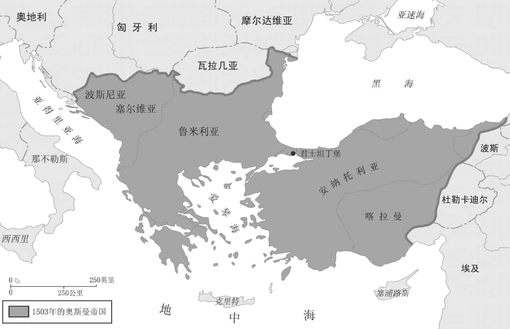
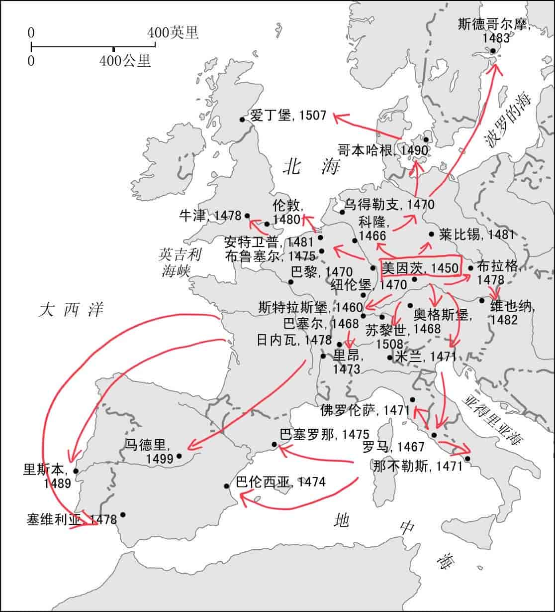

**中世纪**：5世纪～15世纪

## 经济、统治及人口

**一个影响历史的人及家族：雅各布·富格尔(1455~1525)，利用借贷业务向中欧各国统治者提供巨额贷款，推动了欧洲各国经济发展，推动了文艺复兴的形成，影响了贸易路线的扩张。**

**中世纪三大阶层: **

- 神职人员：负责安排人心
- 贵族：拥有大部分土地, 管理事务并参战
- 农民：占总人口85%, 用劳役换取贵族的保护, 除了在西欧拥有土地的农民外, 大部分农民没有法律地位

16世纪初，人口增长（农业产量的小幅增长促成）促进了欧洲贸易的复兴，弥补了14世界中叶黑死病造成的灾难性损失。

### 法律和文化

某种程度上来说，欧洲在16世纪初的四分五裂由这个地区存在的三种法律制度导致的:

- **民事法:** 来自罗马法，统治者颁布并裁定, 有助于主权国家的发展
- **教会法: **教会创立由教会裁定, 从原则上肯定了都会的精神领袖们的权威
- **习惯法: **将约定俗成的习俗编撰成，各地法官单独裁定，由封建习俗发展出来

欧洲政治上的分裂伴随着文化上的分裂，不同的语言进一步强化了彼此文化的不同。

- 神学中心: 巴黎
- 医学中心: 蒙彼利埃(法国靠近巴利阿里海的城市)
- 罗马法研究中心: 博洛尼亚(意大利北部挨着米兰的一个城市, 为意大利最发达的城市之一)
- 13世纪, 牛津和剑桥大学建立
- 1500年前, 城镇中识字人口(尽管当时文盲比例仍旧很高)增长速度高于乡村

### 基督教大分裂

- 公元70年, 罗马人占领耶路撒冷, 罗马教会列于各地方教会之首
- 330年, 罗马皇帝迁都拜占庭, 改名为君士坦丁堡(今伊斯坦布尔), 又名新罗马, 后将君士坦丁堡牧首提升至与教宗并列的首席地位, 受到当时教宗的强烈抗议
- 1053年, 君士坦丁堡牧首把本地拉丁礼教堂全部关闭
- 1054年亨拜枢机(教宗派)进入圣索菲亚大教堂, 留下破门书
- 基督教分裂为**罗马天主教**和**东正教会**
  - 东正教: 继承希腊文化, 俄国和巴尔干半岛大部分人
  - 天主教: 继承拉丁文化, 中欧及西欧
- 中世纪开始，西方基督徒开始试图夺回被穆斯林征服和土地，<u>从1095年~1270年间，总共发动8次“十字军东征”</u>，对他们认为是异教徒的国家发动持续的宗教战争。
- 1204年, 十字军占领了拜占庭帝国
- 1400年, 伊斯兰教的领土从西班牙南部和北非一直延伸到印度北部, 甚至东南亚群岛
- 1453年, 奥斯曼土尔其人占领君士坦丁堡

**奥斯曼帝国**，1299年～1923年，15世纪～19世纪唯一能挑战欧洲基督教国家的**伊斯兰势力**。

奥斯曼帝国的君主苏丹独掌宗教和政治的最高权力，且他的领主们有独立于都会权力的自治权，<u>教皇要求他们的主教和其他神职人员忠于世俗国家的统治者。</u>

奥斯曼帝国允许非穆斯林的存在, 他们占人口的绝大多数. 

- 基督教国家大规模迫害穆斯林, 并将穆斯林驱逐出境. 
- 俄国东西教会, 希腊正教(同属东正教会), 罗马天主教和伊斯兰教在奥斯曼统治下巴尔干半岛和平共处

### 宗教影响

- 宗教主题遍及中世纪几乎所有的艺术和音乐. 12世纪, 人们开始修筑雄伟的哥特式大教堂, 工程往往持续一个世纪.
- 在很多人都不识字的年代, 业余的和专业讲故事的人使大众文化的口述传统得以存续. 
- 大部分人相信魔法和超自然力量的存在.

### 封建制度

为了应付早先的社会动荡及无政府状态，出现了**封建时代的权力结构（国王、领主、封臣、农民）**。国王是教会权力机构任命的, 他们无法控制大领主和他们的家族. **封建制度是一种强大的人从相对较弱的人那里榨取赋税或劳役的体制。**

**在封建时代的欧洲, 城镇是自由的象征, 因为那里的居民在大多数情况下不需要为领主承担各种义务. **但城市的自由权首先必须从贵族领主那获得, 城镇通过免税特许状来获取其他方面的收入. 

在某些情况下, 国王积极与城市形成同盟, 联合起来共同对抗贵族, 城市也会贷款给国王, 让他们发动战争对抗其他反抗者. **在那些国王权力相对薄弱的地区, 如意大利和德意志邦国, 城镇能拥有最大限度的自由. 若国王或贵族的权力相对较大, 城镇发展则相对缓慢. **

14世纪中叶的黑死病消灭了西欧1/3到1/2的人口，劳动力短缺, 导致工资上涨, 农民们能够提高他们的法律地位. 领主们也因黑死病死掉大半, 领主们试图重建封建制度时，遭到农民大起义，国家利用骚乱征收新税，加强权力，促进了封建时代的结束。

### 经济

农业是欧洲经济的基础, 13世纪领主们为了解决劳动力短缺, 给农民提供更优惠的条款, 西欧很多农民成功赎买他们的自由.

**12世纪, 法兰西和英格兰南部农奴制开始消失, 西欧的统治者鼓励农民自由运动，这样让领主对农民的控制减弱，也可以让自由的农民缴税。**

自由农民在西欧出现的同时, 东欧和中欧大部分农民在16世纪失去了自由, 因为领主们想确保稳定的劳动力来源. 这显示出**波兰等地的地方领主正争取脱离国家和其他统治者, 单独统治领地.**

大多数贫困家庭只能依靠面包维生, 黑麦面包和汤是主食, 几乎没有其他食物来源, 肉类是领主和城市居民才能享用的食物, 水果和蔬菜相当稀有. 地中海的土地出产橄榄, 葡萄酒和小麦, 啤酒是德意志, 英格兰和斯堪的纳维亚地区的特产. 

随着商业家族变得越来越富，商人们开始购买土地和贵族头衔。**在每个国家，商人阶级都变得重要起来。**

### 人口

1347年从亚洲传播至君士坦丁堡, 黑死病导致三分之一到一半的人死去.

16世纪的欧洲人，大部分寿命极为短暂。预期寿命大约40年，婴儿大约1/5会在1岁之前夭折。100个新生儿里1/2能够活到20岁，再1/5能够活到40岁。

大部分城镇，死亡率高于出生率。遗弃新生儿很普遍，节欲习俗限制出生率，夫妇一方经常过早死亡，普遍晚婚也是制约因素之一。婚姻往往是包办，妻子在收入管理者和劳动者双重身份下有最低限度的平等地位。

**出轨违背了人们的公正观，因为当时人们认为夫妇双方彼此忠实于对方并相互履行自身义务很重要。**

##贸易发展

**13世纪威尼斯和意大利其他城邦的银行业家族已经建立起相当完备的银行体系。**商人还发明出了汇票(类似支票). 

贸易的发展促进了从事商业和手工业人员的增加，从而出现了行会和学徒制度。

- **纺织品生产**主导当时的制造业经济, 不论是提供给遥远的市场, 还是用于当地人的消费. **10世纪, 阿拉伯人把中国的丝绸生产技术传到欧洲, 意大利的城邦国家首先开始纺织, 到15世纪下半叶, 纺织技术传播到德意场地帮车, 法兰西及西班牙等国, <u>欧洲的纺织品从此不再依赖从波斯或亚洲进口. </u>**
- **布匹制造业**在托斯卡纳(意大利), 法国北部, 佛兰德(比利时北部部分地区)和尼德兰(低地国家, 比利时, 荷兰和卢森堡)发展迅速
- **羊毛产业**在佛兰德兴起
- **羊毛制品**英格兰在14世纪成为主要产地
- **安特卫普(比利时西北部城市, 靠近荷兰)**成为欧洲第一个重要的国际贸易中心

1450年～1550年，行会垄断并规定手艺人的工资，手艺人避免受到行会的束缚, 选择在城市之外或去乡下工作, 拥有原材料的商业资本家看中了乡间廉价劳动力市场, 纷纷把纺纱, 织布和其他工作外包到乡下, 促成制造环节外包的出现，**农村家庭手工业迅速在意大利北部、尼德兰、法国北部和英格兰发展起来。**

**经济的发展和治安的改善导致城镇数量增多。如今欧洲大部分重要城镇在1300年（14世纪初）就已建立。但城镇居民占总人口比例很小.**

1100年左右, 威尼斯, 佛罗伦萨, 热那亚, 米兰和比萨成为独立的城邦国家, 神圣罗马帝国也无法将自己的势力范围扩展至全意大利. 

**由于没有封建领主统治带来的束缚, 意大利城邦国家兴旺发达, 为文艺复兴运动的出现奠定了基础. ** 意大利探险家马可 波罗在1275年甚至到达中国, 并一直待到1292年. 

富商, 待会匠师以及大财主控制着市政府, 进行寡头统治. 

  
<b>神圣罗马帝国</b>
 
<ul>
  <li>时间: 962年~1806年</li>
  <li>293年, 罗马帝国皇帝采取共治制, 将帝国分为东西两半, 476年西罗马帝国彻底解体, 东罗马帝国得以保留, 即后来的"拜占庭帝国"</li>
  <li>以德意志王国为核心, 包括德国和奥地利的周边地区(捷克, 瑞士, 波兰的西半部), 巅峰时期包括荷兰, 比利时, 卢森堡,法国东部, 北意大利</li>
  <li>早期由拥有实权的皇帝来统治, 到中世纪时, 演变成"仅承认神圣罗马皇帝为最高权威, 皇帝对国内诸侯没有直接权力"的形式</li>
  <li>因国家众多, 在宗教改革时成为新旧教派的冲突之地, 三十年战争结束后, 帝国皇帝永远不能干涉国内小国的内政, 帝国名存实亡.</li>
  <li>奥地利大公国的哈布斯堡王朝通过皇室联姻和金钱贿赂, 长期垄断神罗皇位长达400年, 奥地利首都维也纳也成为帝国实际首都, 直到1740年, 这个家族再无男性子嗣. </li>
  <li>在法国大革命时被拿破仑一世强制解散</li>
  <li>纳粹德国称神罗为"德意志第一帝国", 现代的联邦德国, 奥地利两国视神罗为德国历史, 奥地利历史和德意志民族历史的一部分, 捷克也视为波希米亚王国历史一个不可替代的部分.</li>
</ul>

### 自由城市

西欧地区，如英格兰、法国北部、荷兰、佛兰德（比利时西部一个地区）、瑞士，坚持为了自身的独立权利，与统治者、乡村贵族作斗争。

东欧的城镇**缺乏西欧城镇的基础协会组织**，无法遏制贵族权力的强大，没有获得西欧城市的特权, 如俄国沙皇, 俄国的统治者将城镇视为个人财产, 领主要求城镇居民效忠并为自己服务. 

**统治者的权力依旧受到相当大的限制。限制来自**：

- 购买了财政豁免权的城镇居民
- 距离王都很远的地区
- 贵族议会
- 提供贷款的银行家族
- 贵族和神职人员本身，拒绝交税
- 教皇

### 主权国家

1500年时, “国家(state)”一词尚未用于表示一个政治实体, 但当时欧洲最大的君主制国家已经开始具备现代国家的一些特征. 

17世纪以前，东欧和中欧东部地区频发的战争都阻碍了这两个地区出现强大的集权国家。

中世纪时期, 随着统治者要求独立统治, 并开始追求更多权力, 主权国家在西欧得以出现. <u>但这些国家并非现代意义上的“民族国家”, 现代的民族国家出现于18世纪中期, 并在19世纪达到顶峰, 指西班牙, 法国或意大利等国的公民, 因共享相同的民族, 语言和文化, 从而对这个国家有一种认同感. </u> 而中世纪的统治者们管辖的对象错综复杂.

1215年, 英国国王被迫签署<大宪章>, 宪章限定了国王的权力, 是英国普通法和宪法的基石. 

### 国家机关

王室依赖于商业银行家的贷款, 使后者愈发富裕, 并为他们的商业投机提供更多的资本. 随着君主的政权和土地所有权进一步巩固, 世袭的王室统治也逐渐稳定下来. 

15世纪时，欧洲各国间开始建立常规外交，意大利城邦最先开始交换永久定居外交使节, 中期佛罗伦萨, 米兰, 威尼斯及那不勒斯王国都互相定期交换大使. 

## 科技、战争及文化

- **火药**: 促进了枪炮的诞生，战争更频繁，死伤人数更多，战争从小打小闹发展为国际争斗, 在14世纪早期用于战场, 来复枪发明后, 火药被填装入枪支。
- **印刷术**: 印刷术的出现在某种程度上标志着中世纪的结束. 8世纪中国发明雕版印刷术和纸, 13世纪阿拉伯人通过西班牙把雕版印刷术和纸传到欧洲，15世纪，佛兰德工匠发明了一种油基墨和手动印刷机。1450年，德国人约翰内斯·古腾堡发明了金属活字印刷机。

#### 对外扩张

- **1415年葡萄牙人在摩洛哥海岸站稳脚跟，目标是打破穆斯林和威尼斯人的垄断，寻找欧洲人获得亚洲丝绸和香料的新航线。**

- 1492年，西班牙国王害怕葡萄牙商船可能会抢先到达富裕的亚洲，同意支持哥伦布的探险。哥伦布认为地球是圆的，所以不能往非洲绕过去，就一直往西就能到达东方，于是发现了美洲。由于没有找到黄金，他建议西班牙王室可以靠贩卖当地人为奴隶获利。**哥伦布最大的功绩是发现了利用信风横跨大洋的新方法. **

- 1487年迪亚士首次达到非洲最南端，并绕过好望角，进入印度洋海域。

- 1498年，葡萄牙探险家达·伽马运载着香料从印度回到葡萄牙，**葡萄牙人沿着印度洋建立起一条海上航线，并发现了亚洲海上贸易网。**
- 葡萄牙人还发现了一个早已存在于中国, 日本, 东南亚, 印度, 波斯湾以及东非之间繁荣的海上贸易网. 

- 1493年，教皇亚历山大六世把非基督徒的世界划分给西班牙和葡萄牙，为这两个国家征服战争的行为正名。**教皇把非洲撒哈拉沙漠以南地区和亚洲给了葡萄牙，西班牙得到美洲大部分土地。后葡萄牙夺走巴西，使巴西在16世纪下半叶成为美洲最大的殖民地。**

**西班牙征服美洲简述**：

- 1501年，巴拿马
- 1511年，古巴
- 1521年，墨西哥
  - 16世纪40年代, 人们在墨西哥及安第斯山脉发现了更多的银矿, 输入西班牙, 支持西班牙更多融入欧洲贸易体系
- 1532年，印加帝国

- 西班牙人把天花带到美洲，导致印第安人大批死亡。印第安人的梅毒在欧洲传播开。

- 西班牙人给美洲带来了牛马，绵羊，猪

- 西班牙把美洲的烟草, 土豆, 新品种的豆类, 可可, 辣椒和西红柿带回欧洲

- 西班牙在美洲殖民地种植小麦, 大麦, 大米, 燕麦

- 西班牙人要求印第安人必须皈依天主教，并利用宗教美化奴役印第安人的行为

- 欧亚非及南北美五大洲这样的经济往来, 标志着贸易全球化的开端

- 由于疾病, 过度劳累及西班牙人的暴行, 印第安人几乎灭绝. 葡萄牙人很快控制了非洲奴隶贸易网, 1595到1640年间, 约30万奴隶被从非洲送往美洲, 到下个世纪, 奴隶交易人数增长了5倍. 

- 到16世纪中叶, 大约15万西班牙人移民到美洲, 16世纪末, 达到24万人

  

## 总结

三场带来变革的重大运动结束了中世纪时代：

1. **最早于14世纪中叶意大利城邦出现的文艺复兴运动。**独立城邦的繁荣是造就这个时期的首要因素。

2. **新世界的探险和殖民。**结束了地中海作为欧洲经济繁荣的中心的时代。殖民运动促使欧洲海外帝国相应建立起来。

3. **宗教改革。**开始于16世纪20年代，挑战了罗马天主教会在欧洲大部分地区的统治地位，天主教会从此分裂。