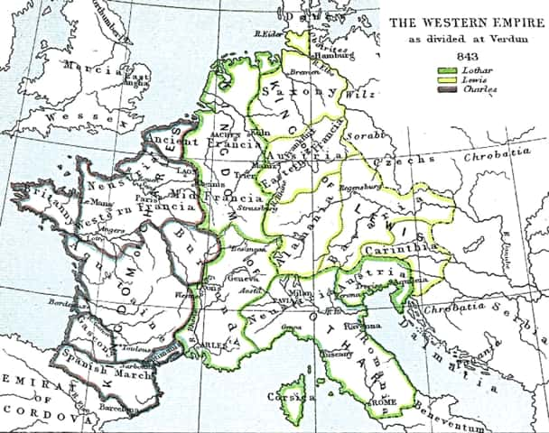

# 神圣罗马帝国

时间: 962年~1806年 

体制: 封建君主制帝国

版图: 以德意志一辆为核心, 包括德国和奥地利的周边地区(捷克, 瑞士, 波兰的西半部), 在巅峰时期还包括费里西亚王国(今日所有低地国家: 荷兰, 比利时, 卢森堡, 勃艮第王国（法国东部）, 意大利王国(现北意大利))

初期为统一的国家, 但在历史的大部分时期, 是一个“徒有国家之名”, 实际上由数百个小的亲王国, 公国, 郡县, 帝国自由城市, 主教国, 都会领地组成的多国集团, 帝国内的小国各自独立为政, 相当于一个成员松散的政治聪明. 

## 背景

293年, 罗马帝国皇帝采行四帝共治制, 将帝国分为东西两半, 此后帝国分分合合. 

395年, 狄奥多西一世将帝国分给两个儿子, 从此分为西罗马帝国(首都 拉文纳)和东罗马帝国(君士坦丁堡). 

476年, 西罗马帝国彻底解体, 东罗马帝国得以保留, 为后来史称的**拜占庭帝国**. 西罗马解体后, 罗马人在巴黎地区的统治继续持续到486年.

476年, 日耳曼民族的法兰克人首领克洛维打败罗马人, 建立法兰克王国, 其后不断发展壮大, 在加洛林家族的查理曼(也称“查理大帝”,法语中的”曼”字由  拉丁语中“伟大的”词演变而来, 本身含有“大帝”的意思)的统治下达到鼎盛, 征服国土范围到今法国, 德国, 荷兰, 瑞士, 北意大利, 波希米亚, 奥地利西部, 伊比利亚半岛东北角的领土. **整个法兰克王国也被称为“加洛林帝国”**, 西罗马帝国以帝位转移至法兰克国王的形式复辟. <u>加洛林帝国奠定了后世的神圣罗马帝国的基石. </u>

840年, 查理大帝儿子路易一世去世后, 843年, 其三子订阅凡尔登条约, 把全国分为三部分, 其中

- 洛塔尔承袭皇帝称号, 拥有自莱茵河下游以南, 经罗纳河流域, 至今意大利中部地区, 为中法兰克王国
- 胖子查理分得莱菌河以工地区, 为东法兰克王国
- 秃头查理拥有险些之外西部地区, 为西法兰克王国

841年胖子查理和秃头查理联合打败了长兄, “罗马皇帝”这个头衔, 始终由东法兰克王国和西法兰克王国君主轮流拥有. 

887年胖子查理被废黜, 加洛林帝国彼此分裂瓦解, 此后再也没统一. 

## 神圣罗马帝国

### 鄂图一世成立帝国

