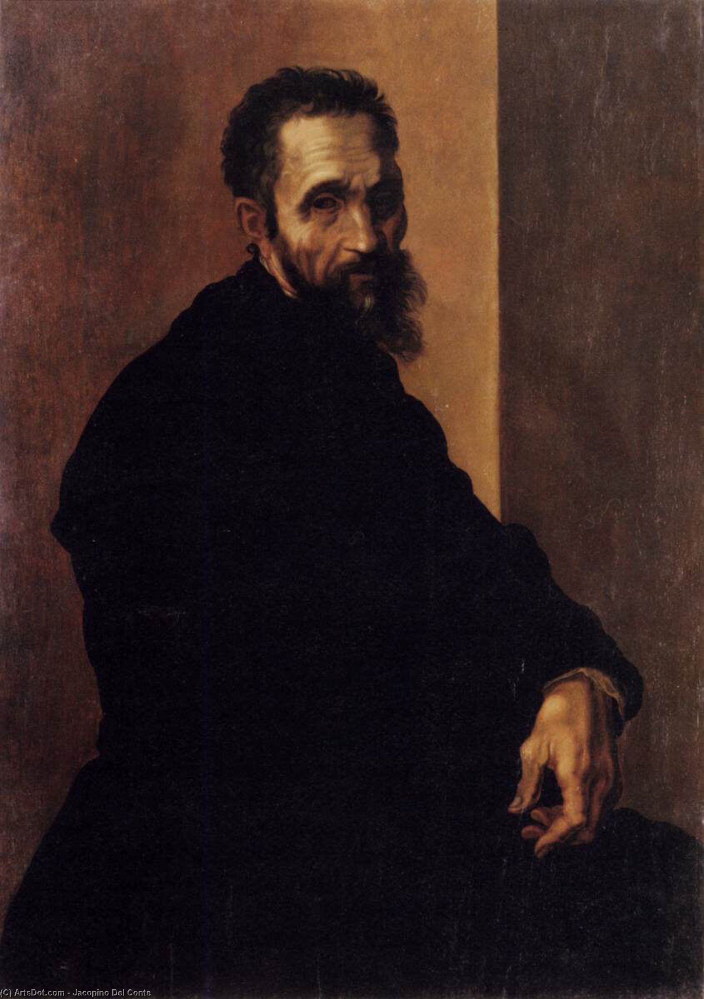

# Michela Angelo

1475年3月6日-1564年2月18日  
生于意大利佛罗伦斯加柏里斯镇

#### Faith

He was a devout Catholic whose faith deepened at the end of his life.

#### Personal habits

Michelangelo was abstemious in his personal life,and once told his apprentice,Ascanio Condivi:"However rich I may have been,I have always lived like a poor man."

Condivi said he was indifferent to food and drink,eating"more out of necessity than of pleasure"and that he"often slept in his clothes and ... boots."

[生平时间线](https://cloud.mindjet.com/?state=%7B%22ids%22:%5B%221L0dCEyWLXW0an--_Wq9LGslbldFNAjJm%22%5D,%22action%22:%22open%22,%22userId%22:%22102538535974868288444%22%7D#gdrive)

