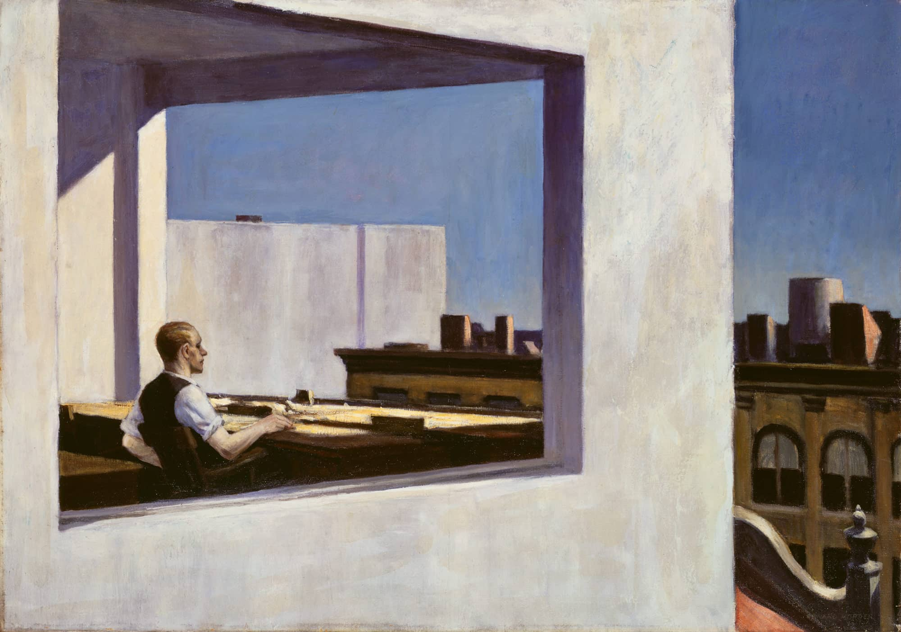
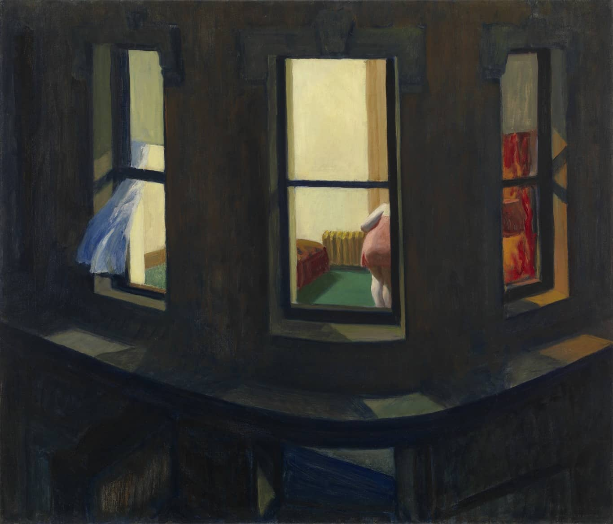
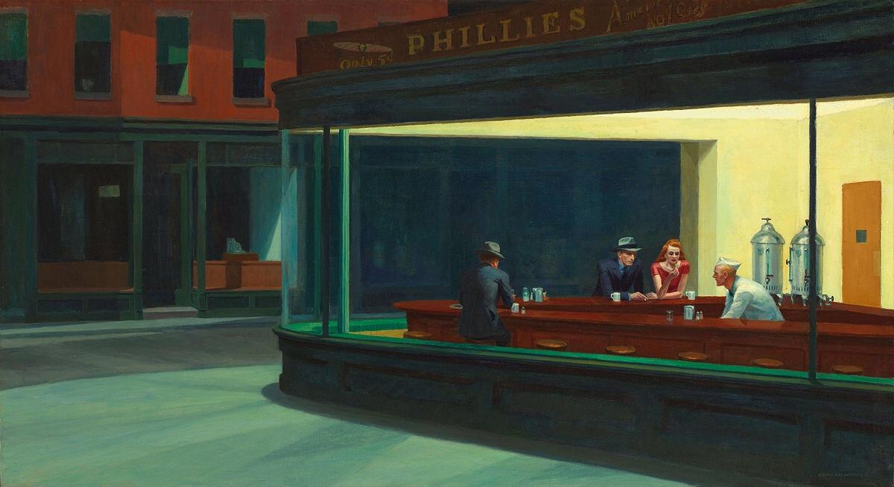

# 玻璃之墙

## 爱德华·霍珀 Edward Hopper

> 我从未想过要去描绘美国的场景，我是在试着描绘我自己。————爱德华·霍珀

  而我们也必须记得，他所取得的这一成就，部分就是通过无情地剥夺了他的妻子实现她自己的艺术表达的权利而得到的。

  

  Morning Sun
  

  Hotel Window
  

  Office in a small city
  

  Rooms by the sea
  

  Night windows
  

  Nighthawks
  

> 孤独，在其最典型的状态下，其本质决定了忍受着这种孤独的人无法将其表述出来。同样，与其他那些无法表述的情感体验相比，一个人无法通过共情与他人分享他的孤独。一个人所散发的孤独感会引发另一个人的焦虑，从而阻碍后者发挥其同理心。————Frieda Fromm-Reichmann

> 为什么孤独无法得到改善呢？他们必定是在孤独里找到了某种有悖于常理的喜悦和满足。也许在痛楚以外，孤独还使他们得以持续沉浸在一种自我保护的孤立状态里，或是给他们造成了一种情感缺陷，迫使与他们交往的人对其予以同情。——————罗伯特·韦斯

孤独的特征之一就是对终结这种体验的强烈诉求，而实现这一目标不能单纯依靠意志力或是更加频繁的室外活动，而是只能与他人建立亲密的联系。说起来远比做起来要容易得多，**尤其是对某些人而言，他们的孤独因失去、流离或偏见的状态而生，所以他们有理由在渴慕他人组成的社群的同时，也感到害怕和不信任。**

在特定的情境下，孑然独立、格格不入，都会成为满足感的来源，甚至给人带来愉悦感。某些情况下的独处，即便不能治愈孤独，也能暂缓它的降临，为人们提供一段喘息的时间。偶尔，当我漫步在威廉斯堡大桥的桥墩下，或是沿着东河一路走到联合国总部的银色大楼旁时，我会忘记那个忧伤的自我，反而变得如同薄雾一般通透，没有边界，愉快地在涌动的城市里随波逐流。待在公寓的时候，我不会有这种感受；唯有当我在外面，彻底地独处或隐匿在人群中时，它才会悄然而至。

每当身处这样的情景中时，我都感到自己被解放了，绵延的孤独的重量，对反常事物的感知，以及因羞辱、评判和注视而生的不安感统统离我而去。但这种自我遗忘的幻觉过不了多久就会幻灭殆尽，然后我就又被拉回到对自我的意识，以及熟悉的、痛苦的缺失感中去。更多情况下，它总是跟言语有关，或者说是一种对交流的需求，以言辞为媒介去理解别人，也让别人理解我。
