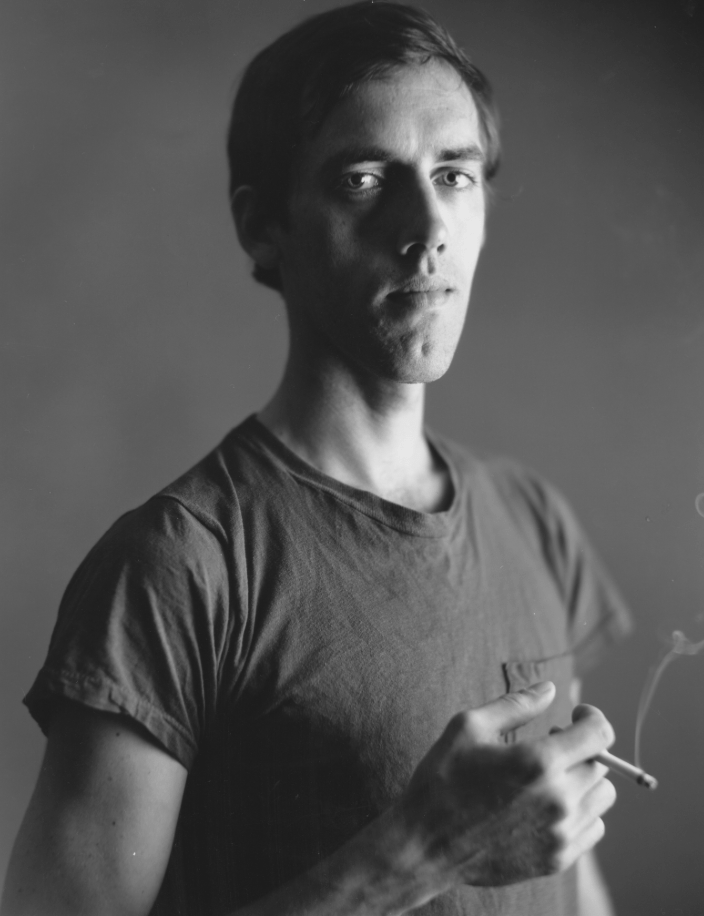

# 在爱着他的时候

面具和孤独之间有着何种联系？最明显的答案是它们都提供了避免暴露、避免被观看的慰藉。拒绝审视其实就是在躲避可能会发生的回绝，尽管这同样也令人失去了被接纳的机会。正因如此，面具才显得如此悲伤，同时又如此神秘、邪恶、令人不安。

面具放大了皮肤作为一道屏障或一面墙的功能，充当着分隔、独特与距离的标志。面具也回避了有关公共自我的问题：人们的公共自我是一种固定的、一成不变的礼貌与顺从，而真实的欲望在其后翻滚、扭曲。

*阿尔蒂尔·兰波在纽约 ———— David Wojnarowicz*

无论他穿过的人群有多庞大，兰波总是独自一人。

> 尽管兰波的面具呈现的是一张空白的、毫无变化的脸，但它似乎总是在观看、吸收所见的事物和经验。然而，直到最后，它都还是孤独的。

**大卫·沃纳洛维奇 David Wojnarowicz**

大卫的作品，全都探寻着有关联结和孤独的总是。他的创作尤其关注了“个体如何才能在一个敌对的社会，一个或许宁愿置于他们于死地也不容忍他们的存在的社会中生存下去”。

“我会周期性地意识到自己陷入了绝望的状态，在那些时刻，我会感觉自己需要去做些特定的事……你让兰波走过一条我曾从中经过的模糊的时间线————我在童年时期曾消磨过时间的地方，曾让我挨过饿、受过冻的地方，或是在某种程度上让我沉溺于其中而难以抽身离去的地方。”

沃纳洛维奇的人生经历显然就是一则关于面具的故事：你为什么需要面具？你为什么不信任它们？它们为什么会变成生存的必需品，而同时又是有害的、令人难以忍受的东西？

> 大卫本质上是个孤独的人。尽管他认识很多人，但他偏好与他们一对一地产生联系。每个人认识的大卫都有些许不同。

谁也无法轻易摆脱那样的童年，精神上的包袱是不可避免的，过去的重担总会产生有害的影响，必须以某种方式去掩盖、背负这种影响，要不就得设法解决它所带来的问题。首先，所有那些虐待和忽视都留下了它们的印记，让他感到无用、羞耻和暴怒，让他感到自己异于常人，在某种程度上低人一等或被打上了票房。**他尤其感到愤怒，并且产生了一种深藏在愤怒之下的，或许永远无法消除的不受待见的感觉。**

南·戈尔丁曾明确地说过，她并不相信通过一张单一的肖像照就能够揭露一个人的内在，相反，**她的目标是要捕捉随着时间变化而产生一系列个性的转变。**

> 在爱着他的时候，我看到llw男人们鼓励彼此放下戒备。在爱着他的时候，我看到小城的劳工们挖掘着其他男人终其一生要去填补的凹洞。在爱着他的时候，我看到石头建筑移动的影像，看到监狱里的一只手把窗台上的雪扒拉进去。在爱着他的时候，我看到宏伟的房屋拔地而起，它们很快又将滑入等候着的、躁动不安的海洋。我看到他将我从内心生活的静谧中释放出来。————《刀锋边缘 Closetothe Knives 》