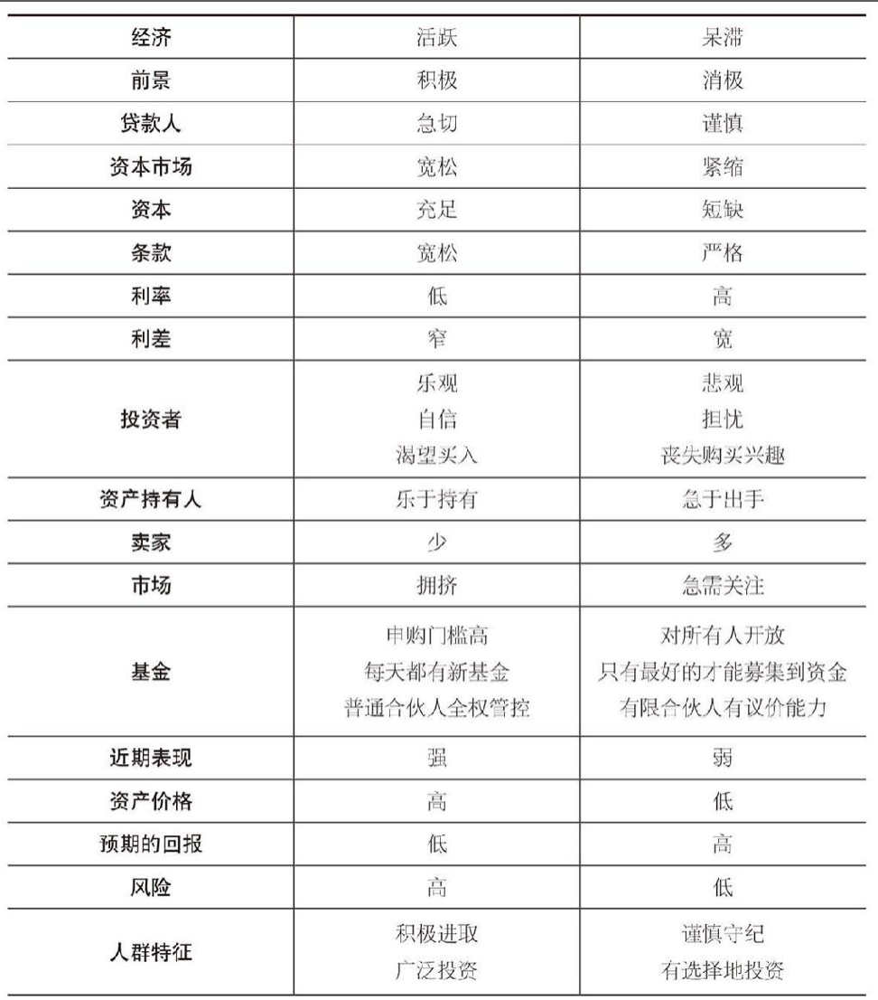

# 正确认识自身

> **我们或许永远不会知道要去哪里，但最好明白我们身在何处。**

即使我们不能预测周期性波动的时间和幅度，力争弄清我们处于周期的哪个阶段并采取相应的行动很重要。

> 忘记过去的人注定会重蹈覆辙，不知道周遭正在发生什么的人一定会受到惩罚。

我们必须力求了解我们身边所发生的事情的含义，倾听市场的声音。

- 投资者是乐观的还是悲观的？
- 媒体认为该入市，还是该出市？
- 新型投资产品是被大众欣然接受，还是避之不及？
- 证券招股和基金上市被视为致富机会，还是潜在陷阱？
- 信贷周期处于资本容易获得，还是难以获得的阶段？
- 市盈率处于历史高位，还是低位？
- 收益率差是收窄的，还是扩大的？

很明确的信号：**资本提供者在竞相提供资本，他们放松条款和利率，而不是要求充分保护和潜在收益。**这表明，过多的资金在追逐过少的交易。市场交易量不断上升，交易容易度也在上升，资本成本下降，被收购资产的价值被连续交易抬高。

测量未来市场温度的小方法，选择任意一个你认为最能贴切描述当前状况的词，如果标记大部分在左侧，该撤退了~：

**努力了解我们身边所发生的事，并以此指导我们的行动。**

